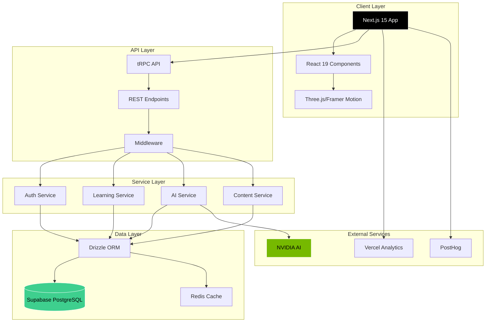
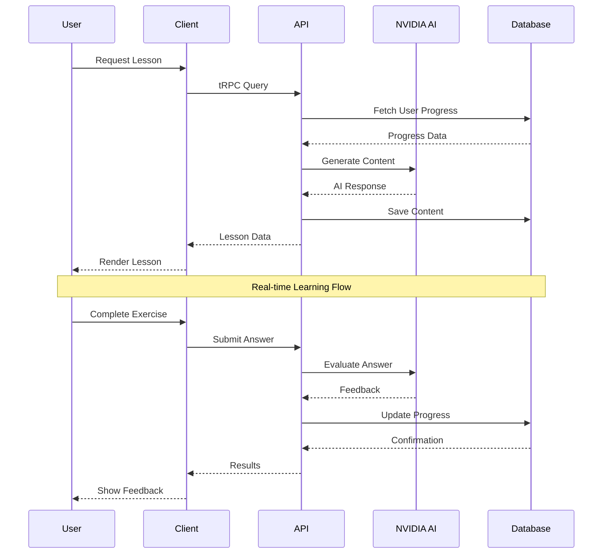
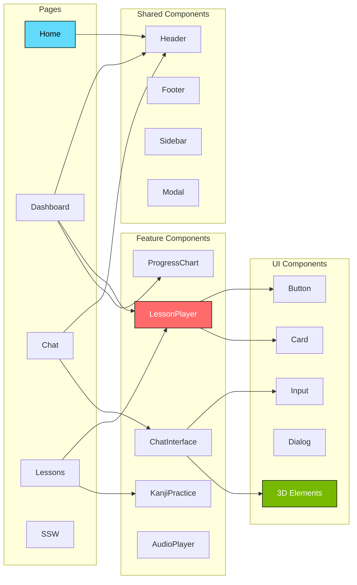
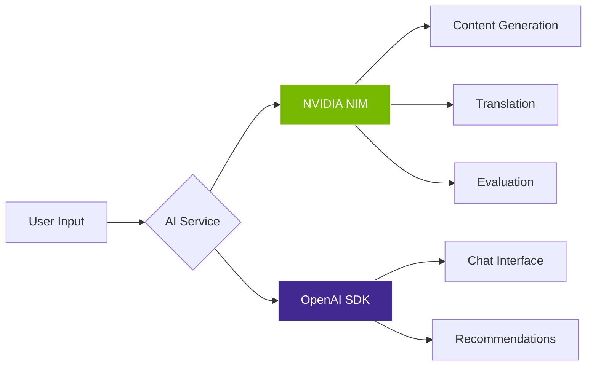
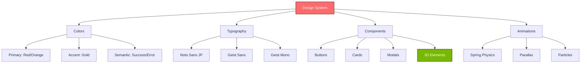
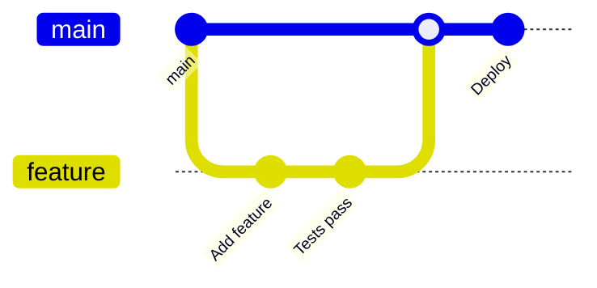

<div align="center">

<!-- Hero Banner -->
<picture>
  <source media="(prefers-color-scheme: dark)" srcset="https://images.pexels.com/photos/2662116/pexels-photo-2662116.jpeg?auto=compress&cs=tinysrgb&w=1260&h=750">
  
</picture>

<h1>
  
  <br/>
  Shinmen Takezo
  <br/>
  <sub>神免武蔵 - AI-Powered Japanese Learning Platform</sub>
</h1>

<p align="center">
  <strong>Master Japanese from JLPT N5 to N1 with Cutting-Edge AI Technology</strong>
</p>

<!-- Badges -->
<p align="center">
  
  
  
  
</p>

<p align="center">
  
  
  
  
</p>

<!-- Project Stats -->
<p align="center">
  
  
  
  
  
</p>

<!-- Quick Links -->
<p align="center">
  <a href="#-features"><b>Features</b></a> •
  <a href="#-demo"><b>Demo</b></a> •
  <a href="#-architecture"><b>Architecture</b></a> •
  <a href="#-tech-stack"><b>Tech Stack</b></a> •
  <a href="#-getting-started"><b>Get Started</b></a> •
  <a href="#-documentation"><b>Docs</b></a> •
  <a href="#-contributing"><b>Contribute</b></a>
</p>

<br/>

</div>

---

## 📑 Table of Contents

<details open>
<summary><b>Click to expand</b></summary>

- [🌸 About The Project](#-about-the-project)
- [✨ Features](#-features)
  - [Core Features](#core-features)
  - [AI-Powered Features](#ai-powered-features)
  - [Advanced Features](#advanced-features)
- [🎬 Demo](#-demo)
- [🏗️ Architecture](#️-architecture)
  - [System Architecture](#system-architecture)
  - [Data Flow](#data-flow)
  - [Component Architecture](#component-architecture)
- [🔧 Tech Stack](#-tech-stack)
  - [Frontend](#frontend)
  - [Backend & Database](#backend--database)
  - [AI & ML](#ai--ml)
  - [Testing & Quality](#testing--quality)
- [🚀 Getting Started](#-getting-started)
  - [Prerequisites](#prerequisites)
  - [Installation](#installation)
  - [Environment Setup](#environment-setup)
  - [Running the App](#running-the-app)
- [📚 Documentation](#-documentation)
- [🎨 UI/UX Showcase](#-uiux-showcase)
- [🗺️ Roadmap](#️-roadmap)
- [🤝 Contributing](#-contributing)
- [📄 License](#-license)
- [👥 Team](#-team)
- [📞 Contact & Support](#-contact--support)
- [🙏 Acknowledgments](#-acknowledgments)

</details>

---

## 🌸 About The Project

<div align="center">

</div>

<br/>

**Shinmen Takezo** (神免武蔵) is named after the legendary Japanese swordsman **Miyamoto Musashi**. Just as Musashi mastered the art of the sword through dedication and discipline, our platform helps you master the Japanese language through AI-powered personalized learning.

### 🎯 Mission

> To democratize Japanese language education by combining traditional learning methods with cutting-edge AI technology, making the journey from hiragana to kanji mastery accessible to everyone, everywhere.

### 🏆 Vision

Become the world's leading AI-powered Japanese learning platform, empowering millions of learners to achieve their dreams of Japanese fluency, whether for career advancement, cultural exploration, or personal enrichment.

### 📊 Key Statistics

| Metric | Value |
|--------|-------|
| **JLPT Levels** | N5, N4, N3, N2, N1 |
| **Vocabulary Words** | 22,000+ |
| **Kanji Characters** | 2,136 |
| **Grammar Patterns** | 600+ |
| **SSW Sectors** | 14 Industries |
| **AI Models** | NVIDIA NIM |
| **Languages** | Japanese ⟷ English |

---

## ✨ Features

### Core Features

<table>
<tr>
<td width="33%" align="center">
  
  <h3>🤖 AI-Powered Learning</h3>
  <p>Personalized content generation and intelligent tutoring powered by NVIDIA AI</p>
</td>
<td width="33%" align="center">
  
  <h3>📚 JLPT N5-N1</h3>
  <p>Complete curriculum covering all JLPT levels from beginner to advanced</p>
</td>
<td width="33%" align="center">
  
  <h3>🔄 Spaced Repetition</h3>
  <p>Optimized review scheduling ensures long-term retention</p>
</td>
</tr>
<tr>
<td width="33%" align="center">
  
  <h3>🎮 Gamification</h3>
  <p>Engaging exercises with points, badges, and achievements</p>
</td>
<td width="33%" align="center">
  
  <h3>💬 AI Chat Tutor</h3>
  <p>24/7 conversational practice with Sensei Tanaka</p>
</td>
<td width="33%" align="center">
  
  <h3>📈 Progress Tracking</h3>
  <p>Detailed analytics and performance insights</p>
</td>
</tr>
</table>

### AI-Powered Features

- 🧠 **Intelligent Content Generation** - AI creates personalized lessons tailored to your level
- 🎯 **Adaptive Learning Paths** - System adjusts difficulty based on your performance
- 💡 **Smart Recommendations** - AI suggests optimal learning materials
- 🗣️ **Pronunciation Training** - Real-time feedback on your pronunciation
- ✍️ **Handwriting Recognition** - Practice writing kanji with instant feedback
- 📖 **Contextual Examples** - AI generates relevant example sentences

### Advanced Features

<details>
<summary><b>Click to see all advanced features</b></summary>

#### 🏢 SSW (Specified Skilled Worker) Program
- Industry-specific vocabulary (14 sectors)
- Technical Japanese training
- Work scenario simulations
- Certification preparation

#### 📚 AI Textbook Generator
- Auto-generate custom textbooks
- Sector-specific content
- Multi-format export (PDF, EPUB)
- Personalized difficulty levels

#### 🎨 3D Interactive UI
- Three.js particle effects
- Immersive Japanese aesthetics
- Smooth Framer Motion animations
- Responsive 3D components

#### 🎵 Audio Learning
- Native speaker pronunciations
- Audio transcription
- Listening comprehension
- Voice recording practice

#### 👥 Social Features
- Community gallery
- Study groups
- Peer learning
- Progress sharing

#### 📊 Analytics Dashboard
- Detailed statistics
- Learning patterns
- Time tracking
- Performance graphs

</details>

---

## 🎬 Demo

### Live Demo

<div align="center">

🔗 **[Try Live Demo](https://shinmen-takezo.vercel.app)** | 📹 **[Watch Video Tour](https://youtu.be/demo)**

</div>

### Screenshots

<div align="center">
<table>
<tr>
<td width="50%">

<p align="center"><b>🎯 Hero Section with 3D Effects</b></p>
</td>
<td width="50%">

<p align="center"><b>📊 Learning Dashboard</b></p>
</td>
</tr>
<tr>
<td width="50%">

<p align="center"><b>💬 AI Chat with Sensei Tanaka</b></p>
</td>
<td width="50%">

<p align="center"><b>📚 Interactive Lessons</b></p>
</td>
</tr>
</table>
</div>

---

## 🏗️ Architecture

### System Architecture



### Data Flow



### Component Architecture



---

## 🔧 Tech Stack

### Frontend

<table>
<tr>
<td>

**Framework & Libraries**

| Technology | Version | Purpose |
|------------|---------|---------|
| Next.js | 15.5.4 | React framework |
| React | 19.2.0 | UI library |
| TypeScript | 5.9.3 | Type safety |
| Tailwind CSS | 4.0 | Styling |
| Framer Motion | 12.23.22 | Animations |
| Three.js | 0.180.0 | 3D graphics |

</td>
<td>

**UI Components**

| Technology | Version | Purpose |
|------------|---------|---------|
| Radix UI | Latest | Primitives |
| Lucide React | 0.545.0 | Icons |
| React Hook Form | 7.64.0 | Forms |
| Recharts | 3.2.1 | Charts |
| Lottie React | 2.4.1 | Animations |
| GSAP | 3.13.0 | Animations |

</td>
</tr>
</table>

### Backend & Database

<table>
<tr>
<td width="50%">

**Backend**

- **Supabase** (2.74.0) - Database & Auth
- **PostgreSQL** 14+ - Relational DB
- **Drizzle ORM** (0.44.6) - Type-safe ORM
- **tRPC** (11.6.0) - End-to-end typesafe APIs
- **NextAuth.js** (4.24.11) - Authentication
- **Upstash Redis** - Caching & Rate limiting

</td>
<td width="50%">

**API & Integration**

- **Vercel AI SDK** (5.0.60) - AI integration
- **NVIDIA AI** - Content generation
- **PostHog** (1.272.0) - Analytics
- **Vercel Analytics** - Performance
- **Arcjet** - Security

</td>
</tr>
</table>

### AI & ML



### Testing & Quality

<table>
<tr>
<td width="33%">

**Testing**

- Vitest 3.2.4
- Playwright 1.56.0
- Testing Library 16.3.0
- MSW 2.11.3

</td>
<td width="33%">

**Code Quality**

- Biome 2.2.5
- ESLint 9
- Prettier 3.6.2
- TypeScript Strict

</td>
<td width="33%">

**Performance**

- Next.js Bundle Analyzer
- Vercel Speed Insights
- Lighthouse CI
- React DevTools

</td>
</tr>
</table>

---

## 🚀 Getting Started

### Prerequisites

Before you begin, ensure you have the following installed:

| Requirement | Version | Check Command |
|-------------|---------|---------------|
| Node.js | 20+ | `node --version` |
| npm | 10+ | `npm --version` |
| Git | Latest | `git --version` |

### Installation

<details open>
<summary><b>Step-by-step Guide</b></summary>

#### 1️⃣ Clone the Repository

```bash
git clone https://github.com/yourusername/shinmen-takezo.git
cd shinmen-takezo
```

#### 2️⃣ Install Dependencies

```bash
npm install
```

#### 3️⃣ Setup Environment Variables

```bash
cp .env.example .env.local
```

Edit `.env.local` with your credentials:

```env
# Database
DATABASE_URL=your_supabase_url
NEXT_PUBLIC_SUPABASE_URL=your_supabase_url
NEXT_PUBLIC_SUPABASE_ANON_KEY=your_anon_key

# AI
NVIDIA_API_KEY=your_nvidia_key

# NextAuth
NEXTAUTH_URL=http://localhost:3000
NEXTAUTH_SECRET=your_secret_key

# Optional
NEXT_PUBLIC_POSTHOG_KEY=your_posthog_key
```

#### 4️⃣ Setup Database

```bash
npm run db:push
```

#### 5️⃣ Run Development Server

```bash
npm run dev
```

#### 6️⃣ Open in Browser

Navigate to [http://localhost:3000](http://localhost:3000)

</details>

### Environment Setup

<details>
<summary><b>Required API Keys</b></summary>

#### Supabase Setup
1. Create account at [supabase.com](https://supabase.com)
2. Create new project
3. Copy URL and anon key from Settings > API

#### NVIDIA AI Setup
1. Sign up at [NVIDIA AI](https://build.nvidia.com)
2. Generate API key
3. Add to `.env.local`

#### Optional Services
- **PostHog**: Analytics ([posthog.com](https://posthog.com))
- **Vercel**: Deployment ([vercel.com](https://vercel.com))

</details>

### Running the App

```bash
# Development mode with Turbopack
npm run dev

# Production build
npm run build

# Start production server
npm start

# Run tests
npm test

# E2E tests
npm run test:e2e

# Type checking
npm run type-check

# Linting
npm run lint

# Format code
npm run format
```

---

## 📚 Documentation

<div align="center">

### 📖 Complete Documentation Hub

**[→ View Full Documentation](./docs/README.md)**

</div>

<table>
<tr>
<td width="33%">

**🚀 Setup & Guides**

- [Complete Setup Guide](./docs/setup/COMPLETE_SETUP_GUIDE.md)
- [Quick Start](./docs/setup/QUICK_START.md)
- [Environment Setup](./docs/setup/ENV_SETUP_INSTRUCTIONS.md)

</td>
<td width="33%">

**🛠️ Development**

- [Implementation Guide](./docs/implementation/IMPLEMENTATION_GUIDE.md)
- [Tech Stack Details](./docs/tech-stack/TECH_STACK_SUMMARY.md)
- [API Integration](./docs/api-integration/)

</td>
<td width="33%">

**🎨 Design & UI**

- [Enhanced UI Guide](./docs/ui-ux/ENHANCED_UI_GUIDE.md)
- [Design Guidelines](./docs/design/VISUAL_DESIGN_GUIDE.md)
- [Component Library](./docs/ui-ux/)

</td>
</tr>
</table>

<details>
<summary><b>📑 Documentation Index</b></summary>

- **Setup & Getting Started** - Installation and configuration
- **Features** - Detailed feature documentation
- **UI/UX** - Design system and components
- **Implementation** - Technical architecture
- **Hero Section** - Landing page details
- **Chat System** - AI chat documentation
- **Textbook Generator** - Content generation
- **Dashboard** - Analytics and tracking
- **Tech Stack** - Technology details
- **API Integration** - AI and external APIs
- **Deployment** - Production setup
- **Contributing** - How to contribute
- **Troubleshooting** - Common issues

[→ Full Documentation Index](./DOCUMENTATION_INDEX.md)

</details>

---

## 🎨 UI/UX Showcase

<div align="center">

### 🌟 Beautiful Japanese-Themed Interface


</div>

### Key Design Features

<table>
<tr>
<td width="50%">

**🎭 Visual Design**

- ✨ 3D particle effects with Three.js
- 🌸 Sakura petal animations
- ⛩️ Traditional Japanese elements
- 🎨 Glassmorphism UI components
- 🌊 Wave patterns (seigaiha)
- 🎋 Seasonal themes

</td>
<td width="50%">

**⚡ Animations**

- 💫 Framer Motion spring physics
- 🎯 Mouse-tracking 3D cards
- 🔄 Smooth page transitions
- 📱 Responsive animations
- 🎪 Particle systems
- ✨ Gradient effects

</td>
</tr>
</table>

### Design System



---

## 🗺️ Roadmap

### ✅ Completed (2024-2025)

- [x] Core learning platform
- [x] AI integration (NVIDIA)
- [x] JLPT N5-N1 content
- [x] SSW program (14 sectors)
- [x] AI chat tutor
- [x] 3D UI with Three.js
- [x] Progress tracking
- [x] Textbook generator
- [x] Social features

### 🚧 In Progress (Q1-Q2 2025)

- [ ] Mobile app (React Native)
- [ ] Speech recognition
- [ ] VR learning mode
- [ ] Multiplayer games
- [ ] Live tutoring
- [ ] Certificate system

### 🔮 Planned (Q3-Q4 2025)

- [ ] AR kanji practice
- [ ] AI video lessons
- [ ] Community marketplace
- [ ] Enterprise edition
- [ ] Multi-language support
- [ ] Offline mode

### 💡 Future Ideas

- [ ] AI-generated immersive stories
- [ ] Virtual Japan tours
- [ ] Cultural exchange platform
- [ ] Business Japanese certification
- [ ] Integration with Japanese apps

---

## 🤝 Contributing

We welcome contributions from the community! Here's how you can help:

### Ways to Contribute

<table>
<tr>
<td width="33%" align="center">
  <h3>🐛 Report Bugs</h3>
  <p>Found a bug? Create an issue with details</p>
  <a href="https://github.com/yourusername/shinmen-takezo/issues/new?template=bug_report.md">Report Bug</a>
</td>
<td width="33%" align="center">
  <h3>💡 Request Features</h3>
  <p>Have an idea? We'd love to hear it</p>
  <a href="https://github.com/yourusername/shinmen-takezo/issues/new?template=feature_request.md">Request Feature</a>
</td>
<td width="33%" align="center">
  <h3>📖 Improve Docs</h3>
  <p>Help make our docs better</p>
  <a href="./docs/contributing/CONTRIBUTING.md">Contribute</a>
</td>
</tr>
</table>

### Development Process



### Quick Start for Contributors

```bash
# 1. Fork the repository
# 2. Clone your fork
git clone https://github.com/your-username/shinmen-takezo.git

# 3. Create a branch
git checkout -b feature/amazing-feature

# 4. Make changes and commit
git add .
git commit -m "Add amazing feature"

# 5. Push to your fork
git push origin feature/amazing-feature

# 6. Create Pull Request
```

### Contribution Guidelines

- ✅ Follow code style (Biome)
- ✅ Write tests
- ✅ Update documentation
- ✅ Keep PRs focused
- ✅ Add meaningful commit messages

**[→ Read Full Contributing Guide](./docs/contributing/CONTRIBUTING.md)**

---

## 📄 License

This project is licensed under the MIT License - see the [LICENSE](LICENSE) file for details.

```
MIT License

Copyright (c) 2025 Shinmen Takezo Team

Permission is hereby granted, free of charge, to any person obtaining a copy
of this software and associated documentation files (the "Software"), to deal
in the Software without restriction...
```

---

## 👥 Team

<div align="center">

### Core Team

<table>
<tr>
<td align="center">

<br/>
<b>Lead Developer</b>
<br/>
<sub>Full Stack & AI</sub>
</td>
<td align="center">

<br/>
<b>UI/UX Designer</b>
<br/>
<sub>Design & Frontend</sub>
</td>
<td align="center">

<br/>
<b>AI Specialist</b>
<br/>
<sub>Machine Learning</sub>
</td>
<td align="center">

<br/>
<b>Content Creator</b>
<br/>
<sub>Japanese Education</sub>
</td>
</tr>
</table>

</div>

---

## 📞 Contact & Support

<div align="center">

### Get in Touch

<table>
<tr>
<td align="center">
  <h3>💬 Chat</h3>
  <a href="https://discord.gg/shinmen-takezo">Discord Server</a>
</td>
<td align="center">
  <h3>📧 Email</h3>
  <a href="mailto:contact@shinmentakezo.com">contact@shinmentakezo.com</a>
</td>
<td align="center">
  <h3>🐦 Twitter</h3>
  <a href="https://twitter.com/shinmentakezo">@shinmentakezo</a>
</td>
<td align="center">
  <h3>💼 LinkedIn</h3>
  <a href="https://linkedin.com/company/shinmentakezo">Company Page</a>
</td>
</tr>
</table>

### Support

- 📖 **[Documentation](./docs/README.md)** - Complete guides
- 🐛 **[Issue Tracker](https://github.com/yourusername/shinmen-takezo/issues)** - Report bugs
- 💬 **[Discussions](https://github.com/yourusername/shinmen-takezo/discussions)** - Ask questions
- 📧 **[Email Support](mailto:support@shinmentakezo.com)** - Direct help

</div>

---

## 🙏 Acknowledgments

<table>
<tr>
<td width="50%">

**Technologies**

- [Next.js](https://nextjs.org) - React framework
- [NVIDIA AI](https://build.nvidia.com) - AI platform
- [Supabase](https://supabase.com) - Backend platform
- [Vercel](https://vercel.com) - Deployment
- [Three.js](https://threejs.org) - 3D graphics

</td>
<td width="50%">

**Resources**

- [Pexels](https://pexels.com) - Free images
- [Radix UI](https://radix-ui.com) - UI primitives
- [Lucide](https://lucide.dev) - Icon library
- [PostHog](https://posthog.com) - Analytics
- Japanese learning community

</td>
</tr>
</table>

**Special Thanks** to all contributors and the open-source community!

---

<div align="center">

### ⭐ Star History

[](https://star-history.com/#yourusername/shinmen-takezo&Date)

---


### Made with ❤️ in Tokyo

**[⬆ Back to Top](#-table-of-contents)**

---

<p align="center">
  <sub>© 2025 Shinmen Takezo. All rights reserved.</sub>
  <br/>
  <sub>神免武蔵 • すべての権利予約</sub>
</p>

</div>
