<div align="center">


# 🗾 Shinmen Takezo
### *神免武蔵 - AI-Powered Japanese Learning Platform*

<p align="center">
  <strong>Master Japanese from JLPT N5 to N1 with Cutting-Edge AI Technology</strong>
</p>

---

### 🏆 Tech Stack

<p align="center">
  
  
  
  
</p>

<p align="center">
  
  
  
  
</p>

<p align="center">
  
  
  
  
</p>

---

### 📊 Project Stats

<p align="center">
  
  
  
  
</p>

<p align="center">
  
  
  
  
</p>

---

<p align="center">
  <a href="#-features"><b>Features</b></a> •
  <a href="#-architecture"><b>Architecture</b></a> •
  <a href="#-quick-start"><b>Quick Start</b></a> •
  <a href="#-tech-stack"><b>Tech Stack</b></a> •
  <a href="#-documentation"><b>Docs</b></a> •
  <a href="#-contributing"><b>Contributing</b></a>
</p>

</div>

---

## 🌸 About The Project

<table>
<tr>
<td width="60%">

**Shinmen Takezo** (神免武蔵) is named after the legendary Japanese swordsman **Miyamoto Musashi**. Just as Musashi mastered the art of the sword through dedication and discipline, our platform helps you master the Japanese language through AI-powered personalized learning.

### 🎯 Mission

To democratize Japanese language education by combining traditional learning methods with cutting-edge AI technology, making the journey from hiragana to kanji mastery accessible to everyone, everywhere.

### ⭐ Why Choose Shinmen Takezo?

- 🤖 **AI-Powered Learning**: NVIDIA's 100B parameter model generates personalized content
- 📚 **Complete JLPT Coverage**: From absolute beginner (N5) to near-native (N1)
- 🏢 **SSW Workplace Training**: Industry-specific Japanese for 14 sectors
- ✍️ **Advanced Kanji Practice**: AI-powered handwriting analysis with stroke-order guidance
- 🎤 **Multi-Voice Audio**: 4 voices, 3 speeds for perfect pronunciation
- 📊 **Progress Analytics**: Track your improvement with PostHog integration
- ⚡ **Lightning Fast**: Built with Next.js 15 + Turbopack for optimal performance

</td>
<td width="40%">


</td>
</tr>
</table>

---

## ✨ Features

### 🎓 JLPT Preparation System (N5 → N1)

```mermaid
%%{init: {'theme':'base', 'themeVariables': { 'primaryColor':'#ff6b6b'}}}%%
graph LR
    A[🌱 N5<br/>Beginner<br/>150-200h] -->|Basic Grammar| B[🌿 N4<br/>Elementary<br/>300-400h]
    B -->|Kanji 300+| C[🍃 N3<br/>Intermediate<br/>450-600h]
    C -->|Business JP| D[🌳 N2<br/>Advanced<br/>600-800h]
    D -->|Native Level| E[🎋 N1<br/>Mastery<br/>900-1200h]
    
    style A fill:#ffd43b,stroke:#fab005,stroke-width:3px,color:#000
    style B fill:#74c0fc,stroke:#339af0,stroke-width:3px,color:#000
    style C fill:#b2f2bb,stroke:#51cf66,stroke-width:3px,color:#000
    style D fill:#ffa8a8,stroke:#ff6b6b,stroke-width:3px,color:#000
    style E fill:#d0bfff,stroke:#9775fa,stroke-width:3px,color:#000
```

<div align="center">



</div>

<table>
<tr>
<th>Level</th>
<th>Kanji</th>
<th>Vocabulary</th>
<th>Grammar Points</th>
<th>Study Hours</th>
<th>Description</th>
</tr>
<tr>
<td align="center"><b>🌱 N5</b></td>
<td align="center">100</td>
<td align="center">800</td>
<td align="center">80</td>
<td align="center">150-200h</td>
<td>Basic greetings, hiragana, katakana, simple conversations</td>
</tr>
<tr>
<td align="center"><b>🌿 N4</b></td>
<td align="center">300</td>
<td align="center">1,500</td>
<td align="center">200</td>
<td align="center">300-400h</td>
<td>Daily conversations, basic reading comprehension</td>
</tr>
<tr>
<td align="center"><b>🍃 N3</b></td>
<td align="center">650</td>
<td align="center">3,750</td>
<td align="center">350</td>
<td align="center">450-600h</td>
<td>Newspaper articles, business contexts, complex topics</td>
</tr>
<tr>
<td align="center"><b>🌳 N2</b></td>
<td align="center">1,000</td>
<td align="center">6,000</td>
<td align="center">600</td>
<td align="center">600-800h</td>
<td>News, journals, abstract concepts, workplace communication</td>
</tr>
<tr>
<td align="center"><b>🎋 N1</b></td>
<td align="center">2,000+</td>
<td align="center">10,000+</td>
<td align="center">800+</td>
<td align="center">900-1200h</td>
<td>Native-level comprehension, specialized fields, literature</td>
</tr>
</table>

---

### 🏢 SSW Workplace Japanese Training

<div align="center">

**14 Industry Sectors Supported**

<table>
<tr>
<td align="center" width="25%">

#### 🏥 Healthcare
**介護 (Kaigo)**

Caregiving<br/>
Nursing<br/>
Medical Support

</td>
<td align="center" width="25%">

#### 🏗️ Construction
**建設 (Kensetsu)**

Building<br/>
Civil Engineering<br/>
Architecture

</td>
<td align="center" width="25%">

#### 🍜 Food Service
**外食業 (Gaishoku)**

Restaurants<br/>
Cafes<br/>
Food Preparation

</td>
<td align="center" width="25%">

#### 🏭 Manufacturing
**製造業 (Seizō)**

Factory Work<br/>
Assembly<br/>
Quality Control

</td>
</tr>
<tr>
<td align="center">

#### 🌾 Agriculture
**農業 (Nōgyō)**

Farming<br/>
Crop Production<br/>
Livestock

</td>
<td align="center">

#### 🚢 Shipbuilding
**造船 (Zōsen)**

Ship Construction<br/>
Marine Engineering<br/>
Repairs

</td>
<td align="center">

#### 🐟 Fisheries
**漁業 (Gyogyō)**

Fishing<br/>
Aquaculture<br/>
Processing

</td>
<td align="center">

#### ✈️ Aviation
**航空 (Kōkū)**

Ground Handling<br/>
Maintenance<br/>
Services

</td>
</tr>
<tr>
<td align="center">

#### 🧹 Cleaning
**ビルクリーニング**

Building Cleaning<br/>
Maintenance<br/>
Sanitation

</td>
<td align="center">

#### 🏨 Hospitality
**宿泊 (Shukuhaku)**

Hotels<br/>
Ryokans<br/>
Guest Services

</td>
<td align="center">

#### 🔧 Automotive
**自動車整備**

Car Maintenance<br/>
Repairs<br/>
Inspection

</td>
<td align="center">

#### ⚙️ Machinery
**産業機械**

Industrial Machines<br/>
Equipment<br/>
Operations

</td>
</tr>
<tr>
<td align="center">

#### 🥖 Food Manufacturing
**飲食料品製造**

Food Processing<br/>
Packaging<br/>
Distribution

</td>
<td align="center">

#### 🔩 Material Processing
**素形材産業**

Metal Processing<br/>
Casting<br/>
Forging

</td>
<td align="center" colspan="2">

### 📊 SSW Content Available
**1,540+** Vocabulary Terms<br/>
**98** Workplace Scenarios<br/>
**110+** Safety-Critical Terms

</td>
</tr>
</table>

</div>

---

### ✍️ Kanji Mastery System

<table>
<tr>
<td width="50%">

#### 📺 Stroke Order Animation

- **SVG-Based Animations**: Watch each stroke drawn in perfect order
- **Step-by-Step Playback**: Play, pause, reset, navigate strokes
- **Progress Tracking**: "Stroke 1 of 4" with visual progress bar
- **Writing Tips**: Proper technique guidance for each character
- **Common Mistakes**: Learn what to avoid
- **Similar Kanji**: Related characters and meanings
- **Difficulty Ratings**: 1-5 stars based on complexity
- **JLPT Classification**: Know which level each kanji belongs to

#### ✏️ AI Handwriting Analysis

- **Real-Time Scoring**: 0-100% accuracy analysis
- **Stroke Order Detection**: Verifies correct stroke sequence
- **Execution Quality**: Smoothness, length, angle analysis
- **Detailed Feedback**: Strengths and areas for improvement
- **Personalized Tips**: AI-generated recommendations
- **Progress Tracking**: See improvement over time
- **Touch & Mouse Support**: Practice anywhere, any device

```mermaid
%%{init: {'theme':'base', 'themeVariables': { 'primaryColor':'#4c6ef5'}}}%%
graph TD
    A[👤 User Draws Kanji] -->|Canvas Input| B[📊 Stroke Capture]
    B -->|Data Analysis| C{🔍 AI Analysis}
    C -->|Stroke Order| D[✅ Order Check]
    C -->|Execution| E[📐 Quality Check]
    C -->|Count| F[🔢 Count Check]
    
    D -->|Correct| G[+30 pts]
    D -->|Incorrect| H[-10 pts]
    
    E -->|Good| I[+50 pts]
    E -->|Fair| J[+25 pts]
    E -->|Poor| K[+0 pts]
    
    F -->|Match| L[+20 pts]
    F -->|Mismatch| M[+0 pts]
    
    G --> N[📊 Calculate Score]
    H --> N
    I --> N
    J --> N
    K --> N
    L --> N
    M --> N
    
    N -->|Score ≥90| O[🎉 Mastery!]
    N -->|Score 70-89| P[✅ Good]
    N -->|Score 50-69| Q[⚠️ Practice]
    N -->|Score <50| R[❌ Retry]
    
    O -->|Track| S[📈 Progress DB]
    P --> S
    Q --> S
    R --> S
    
    style A fill:#ff6b6b,stroke:#c92a2a,stroke-width:3px,color:#fff
    style C fill:#4c6ef5,stroke:#364fc7,stroke-width:3px,color:#fff
    style N fill:#ffd43b,stroke:#fab005,stroke-width:3px,color:#000
    style O fill:#51cf66,stroke:#2f9e44,stroke-width:3px,color:#fff
    style S fill:#d0bfff,stroke:#9775fa,stroke-width:2px,color:#fff
```

</td>
<td width="50%">



**Kanji Available**: 17+ characters with complete stroke data

</td>
</tr>
</table>

---

### 🎤 Multi-Voice Audio System

```mermaid
%%{init: {'theme':'base', 'themeVariables': { 'primaryColor':'#f06595'}}}%%
graph LR
    A[📝 Japanese Text] -->|Request| B{🎙️ Voice Selector}
    B -->|Male| C[👨 Keita]
    B -->|Female| D[👩 Nanami]
    B -->|Child| E[👶 Aoi]
    B -->|Elderly| F[👴 Mayu]
    
    C --> G{⚡ Speed Selector}
    D --> G
    E --> G
    F --> G
    
    G -->|Slow -20%| H[🐢 Learning Mode]
    G -->|Normal 100%| I[▶️ Natural Pace]
    G -->|Fast +20%| J[⚡ Challenge Mode]
    
    H --> K[☁️ Azure TTS API]
    I --> K
    J --> K
    
    K -->|Generate| L[🔊 Audio File]
    L -->|Cache| M[💾 Storage]
    L -->|Stream| N[📱 Player]
    
    N -->|Track| O[📊 Analytics]
    M -->|Reuse| N
    
    style A fill:#ff6b6b,stroke:#c92a2a,stroke-width:2px,color:#fff
    style B fill:#f06595,stroke:#d6336c,stroke-width:3px,color:#fff
    style G fill:#ffd43b,stroke:#fab005,stroke-width:3px,color:#000
    style K fill:#4c6ef5,stroke:#364fc7,stroke-width:2px,color:#fff
    style N fill:#51cf66,stroke:#2f9e44,stroke-width:2px,color:#fff
```

<div align="center">



</div>

<table>
<tr>
<td align="center" width="25%">

### 👨 Male Voice
**Keita Neural**

Professional<br/>
Clear pronunciation<br/>
Business contexts

</td>
<td align="center" width="25%">

### 👩 Female Voice
**Nanami Neural**

Natural<br/>
Warm tone<br/>
Daily conversations

</td>
<td align="center" width="25%">

### 👶 Child Voice
**Aoi Neural**

Young learner<br/>
Simple vocabulary<br/>
Beginner friendly

</td>
<td align="center" width="25%">

### 👴 Elderly Voice
**Mayu Neural**

Traditional<br/>
Formal speech<br/>
Cultural contexts

</td>
</tr>
</table>

---

## 🏗️ System Architecture

### High-Level Architecture

<div align="center">


</div>

### Data Flow Architecture

<div align="center">


</div>

### SSW Textbook Generation Flow

```mermaid
%%{init: {'theme':'base', 'themeVariables': { 'primaryColor':'#fd7e14'}}}%%
stateDiagram-v2
    [*] --> UserInput
    
    UserInput --> Validation: Submit Form
    note right of UserInput
        • Title
        • SSW Type
        • Target Sector
        • Chapter Count
        • Options
    end note
    
    Validation --> CreateJob: Valid ✅
    Validation --> Error: Invalid ❌
    
    CreateJob --> ChapterLoop
    note right of CreateJob
        Database Record Created
        Status: "generating"
    end note
    
    ChapterLoop --> FetchVocab: For Each Chapter
    FetchVocab --> BuildPrompt
    BuildPrompt --> CallAI
    
    CallAI --> ParseResponse: NVIDIA API
    note right of CallAI
        100B Parameter Model
        Japanese Specialist
    end note
    
    ParseResponse --> GenerateAudio: Success
    GenerateAudio --> SaveChapter
    
    SaveChapter --> UpdateProgress
    UpdateProgress --> ChapterLoop: More Chapters
    UpdateProgress --> Finalize: All Done
    
    Finalize --> Complete
    note right of Finalize
        • Mark as "completed"
        • Calculate total time
        • Update statistics
    end note
    
    Complete --> [*]
    Error --> [*]
    
    state ChapterLoop {
        [*] --> Processing
        Processing --> [*]: Chapter Complete
    }
```

<div align="center">



</div>

---

## 🛠️ Tech Stack Deep Dive

### Frontend Technologies

<table>
<tr>
<th width="25%">Technology</th>
<th width="15%">Version</th>
<th width="60%">Why We Use It</th>
</tr>
<tr>
<td>
<br/>
<b>Next.js</b>
</td>
<td><code>15.5.4</code></td>
<td>
• <b>App Router</b> for modern routing<br/>
• <b>Server Components</b> for optimal performance<br/>
• <b>Turbopack</b> for 5x faster builds<br/>
• <b>Image Optimization</b> built-in<br/>
• <b>API Routes</b> for backend logic
</td>
</tr>
<tr>
<td>
<br/>
<b>React</b>
</td>
<td><code>19.2.0</code></td>
<td>
• <b>React 19</b> latest features<br/>
• <b>Concurrent Rendering</b> for smooth UX<br/>
• <b>Suspense & Transitions</b> for better loading<br/>
• <b>Automatic Batching</b> for performance<br/>
• <b>Server Components</b> support
</td>
</tr>
<tr>
<td>
<br/>
<b>TypeScript</b>
</td>
<td><code>5.9.3</code></td>
<td>
• <b>100% Type Safety</b> across codebase<br/>
• <b>IntelliSense</b> for better DX<br/>
• <b>Compile-time Errors</b> catch bugs early<br/>
• <b>Path Aliases</b> for clean imports<br/>
• <b>Strict Mode</b> enabled
</td>
</tr>
<tr>
<td>
<br/>
<b>Tailwind CSS</b>
</td>
<td><code>4.0</code></td>
<td>
• <b>Utility-First</b> for rapid development<br/>
• <b>Custom Design System</b> configured<br/>
• <b>Dark Mode</b> support built-in<br/>
• <b>Responsive</b> by default<br/>
• <b>Purge CSS</b> for tiny bundles
</td>
</tr>
<tr>
<td>
<br/>
<b>Framer Motion</b>
</td>
<td><code>12.23.22</code></td>
<td>
• <b>Smooth Animations</b> 60fps guaranteed<br/>
• <b>Page Transitions</b> for better UX<br/>
• <b>Gesture Support</b> touch & mouse<br/>
• <b>Layout Animations</b> automatic<br/>
• <b>Production-Ready</b> performance
</td>
</tr>
</table>

### Backend & Database

<table>
<tr>
<th width="25%">Technology</th>
<th width="15%">Version</th>
<th width="60%">Why We Use It</th>
</tr>
<tr>
<td>
<br/>
<b>Supabase</b>
</td>
<td><code>2.74.0</code></td>
<td>
• <b>Open Source</b> Firebase alternative<br/>
• <b>PostgreSQL</b> powerful relational DB<br/>
• <b>Real-time</b> subscriptions built-in<br/>
• <b>Row Level Security</b> for data protection<br/>
• <b>Auth & Storage</b> included
</td>
</tr>
<tr>
<td>
<br/>
<b>PostgreSQL</b>
</td>
<td><code>14+</code></td>
<td>
• <b>17 Tables</b> with optimized indexes<br/>
• <b>JSONB Support</b> for flexible data<br/>
• <b>Full-Text Search</b> built-in<br/>
• <b>Triggers & Functions</b> for automation<br/>
• <b>ACID Compliant</b> for reliability
</td>
</tr>
<tr>
<td>
<br/>
<b>Drizzle ORM</b>
</td>
<td><code>0.44.6</code></td>
<td>
• <b>Type-Safe Queries</b> with TypeScript<br/>
• <b>Zero Runtime Overhead</b> maximum speed<br/>
• <b>SQL-Like Syntax</b> familiar and powerful<br/>
• <b>Migration System</b> version control for DB<br/>
• <b>Best Performance</b> vs other ORMs
</td>
</tr>
<tr>
<td>
<br/>
<b>tRPC</b>
</td>
<td><code>11.6.0</code></td>
<td>
• <b>End-to-End Type Safety</b> frontend to backend<br/>
• <b>No Code Generation</b> automatic types<br/>
• <b>React Query Integration</b> caching built-in<br/>
• <b>Lightweight</b> tiny bundle size<br/>
• <b>Developer Experience</b> autocomplete everywhere
</td>
</tr>
<tr>
<td>
<br/>
<b>Upstash Redis</b>
</td>
<td><code>Latest</code></td>
<td>
• <b>Serverless Redis</b> no infra management<br/>
• <b>Edge Caching</b> global distribution<br/>
• <b>Rate Limiting</b> API protection<br/>
• <b>Session Storage</b> fast access<br/>
• <b>Pay-Per-Request</b> cost-effective
</td>
</tr>
</table>

### AI & Machine Learning

<table>
<tr>
<th width="25%">Service</th>
<th width="15%">Model/Version</th>
<th width="60%">Use Case & Benefits</th>
</tr>
<tr>
<td>
<br/>
<b>NVIDIA NIM</b>
</td>
<td><code>stockmark-2<br/>100B params</code></td>
<td>
• <b>Japanese Language Specialist</b> trained on JP corpus<br/>
• <b>SSW Textbook Generation</b> industry-specific content<br/>
• <b>Grammar Explanations</b> clear and contextualized<br/>
• <b>Vocabulary Contexts</b> real-world usage examples<br/>
• <b>High Quality Output</b> 98%+ accuracy
</td>
</tr>
<tr>
<td>
<br/>
<b>Vercel AI SDK</b>
</td>
<td><code>5.0.60</code></td>
<td>
• <b>Streaming AI Responses</b> real-time generation<br/>
• <b>80% Less Boilerplate</b> simplified integration<br/>
• <b>React Hooks</b> useChat, useCompletion<br/>
• <b>Provider Agnostic</b> switch models easily<br/>
• <b>Edge Runtime</b> optimized performance
</td>
</tr>
<tr>
<td>
<br/>
<b>PostHog</b>
</td>
<td><code>1.272.0</code></td>
<td>
• <b>Product Analytics</b> 20+ custom events<br/>
• <b>Session Recording</b> watch user interactions<br/>
• <b>Feature Flags</b> A/B testing capability<br/>
• <b>Heatmaps</b> understand UI usage<br/>
• <b>Funnel Analysis</b> optimize conversions
</td>
</tr>
<tr>
<td>
<br/>
<b>Azure TTS</b>
</td>
<td><code>Neural Voices</code></td>
<td>
• <b>4 Japanese Voices</b> male, female, child, elderly<br/>
• <b>3 Speed Options</b> slow, normal, fast<br/>
• <b>Natural Prosody</b> human-like intonation<br/>
• <b>High Quality</b> 24kHz audio<br/>
• <b>Reliable</b> 99.9% uptime SLA
</td>
</tr>
</table>

### Developer Tools

<table>
<tr>
<th width="25%">Tool</th>
<th width="15%">Version</th>
<th width="60%">Purpose & Impact</th>
</tr>
<tr>
<td>
<br/>
<b>Biome</b>
</td>
<td><code>2.2.5</code></td>
<td>
• <b>25x Faster</b> than ESLint + Prettier (2.5s → 0.1s)<br/>
• <b>All-in-One</b> linting + formatting + imports<br/>
• <b>Zero Config</b> works out of the box<br/>
• <b>Better Errors</b> clearer diagnostic messages<br/>
• <b>Saves Time</b> 10min/day on 250+ lint runs
</td>
</tr>
<tr>
<td>
<br/>
<b>Vitest</b>
</td>
<td><code>3.2.4</code></td>
<td>
• <b>Vite-Powered</b> instant test runs<br/>
• <b>Jest Compatible</b> easy migration<br/>
• <b>UI Mode</b> visual test runner<br/>
• <b>Coverage Reports</b> built-in<br/>
• <b>Watch Mode</b> re-run on changes
</td>
</tr>
<tr>
<td>
<br/>
<b>Playwright</b>
</td>
<td><code>1.56.0</code></td>
<td>
• <b>E2E Testing</b> full user flows<br/>
• <b>Cross-Browser</b> Chrome, Firefox, Safari<br/>
• <b>Auto-Wait</b> no flaky tests<br/>
• <b>Screenshots & Videos</b> debugging made easy<br/>
• <b>CI/CD Ready</b> Docker support
</td>
</tr>
<tr>
<td>
<br/>
<b>GitHub Actions</b>
</td>
<td><code>Latest</code></td>
<td>
• <b>CI/CD Pipeline</b> automated testing<br/>
• <b>Auto Deploy</b> to Vercel on push<br/>
• <b>Code Quality</b> lint on every PR<br/>
• <b>Security Scans</b> dependency checks<br/>
• <b>Free for Open Source</b> unlimited minutes
</td>
</tr>
</table>

---

## 🚀 Quick Start

### Prerequisites

<div align="center">

<table>
<tr>
<td align="center" width="33%">

### 📦 Required


</td>
<td align="center" width="33%">

### 🔑 API Keys


</td>
<td align="center" width="33%">

### ⏱️ Time Required

**5 Minutes**<br/>
Basic Setup

**15 Minutes**<br/>
With Database

**30 Minutes**<br/>
Full Configuration

</td>
</tr>
</table>

</div>

### Installation Steps

```bash
# 1️⃣ Clone Repository
git clone https://github.com/yourusername/shinmen-takezo.git
cd shinmen-takezo

# 2️⃣ Install Dependencies
npm install
# ⏱️ Takes ~2 minutes

# 3️⃣ Environment Setup
cp .env.example .env.local
# Edit .env.local with your credentials

# 4️⃣ Database Migrations
# Go to Supabase Dashboard → SQL Editor
# Run migrations from database/migrations/ (in order: 001, 002, ... 016)

# 5️⃣ Start Development Server
npm run dev
# ✅ Open http://localhost:3000
```

### Environment Variables

```bash
# 🗄️ Database (Required)
NEXT_PUBLIC_SUPABASE_URL=https://your-project.supabase.co
NEXT_PUBLIC_SUPABASE_ANON_KEY=eyJhbGciOiJIUzI1NiIsInR5cCI6IkpXVCJ9...
SUPABASE_SERVICE_ROLE_KEY=eyJhbGciOiJIUzI1NiIsInR5cCI6IkpXVCJ9...

# 🤖 AI Services (Required)
NVIDIA_API_KEY=nvapi-xxxxxxxxxxxxxxxxxxxxxxxxxxxxx

# 📊 Analytics (Optional but Recommended)
NEXT_PUBLIC_POSTHOG_KEY=phc_xxxxxxxxxxxxxxxxxxxxxxxx
NEXT_PUBLIC_POSTHOG_HOST=https://app.posthog.com

# 🎤 Audio (Optional - works without)
AZURE_SPEECH_KEY=xxxxxxxxxxxxxxxxxxxxxxxxxxxxxxxx
AZURE_SPEECH_REGION=eastus
```

### Development Commands

<table>
<tr>
<th width="30%">Command</th>
<th width="70%">Description</th>
</tr>
<tr>
<td><code>npm run dev</code></td>
<td>🚀 Start development server with Turbopack (http://localhost:3000)</td>
</tr>
<tr>
<td><code>npm run build</code></td>
<td>📦 Build production bundle (~30s with Turbopack)</td>
</tr>
<tr>
<td><code>npm run start</code></td>
<td>▶️ Start production server</td>
</tr>
<tr>
<td><code>npm run lint</code></td>
<td>🔍 Run Biome linter (0.1s - 25x faster!)</td>
</tr>
<tr>
<td><code>npm run lint:fix</code></td>
<td>🔧 Auto-fix linting issues</td>
</tr>
<tr>
<td><code>npm run format</code></td>
<td>🎨 Format code with Biome</td>
</tr>
<tr>
<td><code>npm run type-check</code></td>
<td>📘 Check TypeScript types</td>
</tr>
<tr>
<td><code>npm run test</code></td>
<td>🧪 Run unit tests with Vitest</td>
</tr>
<tr>
<td><code>npm run test:e2e</code></td>
<td>🎭 Run E2E tests with Playwright</td>
</tr>
<tr>
<td><code>npm run db:studio</code></td>
<td>🗄️ Open Drizzle Studio (database GUI)</td>
</tr>
</table>

---

## 📊 Performance Metrics

<div align="center">

### ⚡ Speed Improvements

<table>
<tr>
<th width="25%">Metric</th>
<th width="25%">Before</th>
<th width="25%">After</th>
<th width="25%">Improvement</th>
</tr>
<tr>
<td><b>Linting Speed</b></td>
<td>2.5 seconds</td>
<td>0.6 seconds</td>
<td><span style="color: #51cf66;">⚡ <b>4.2x faster</b></span></td>
</tr>
<tr>
<td><b>Build Time</b></td>
<td>45 seconds</td>
<td>10 seconds</td>
<td><span style="color: #51cf66;">⚡ <b>4.5x faster</b></span></td>
</tr>
<tr>
<td><b>AI Code Lines</b></td>
<td>50 lines</td>
<td>10 lines</td>
<td><span style="color: #51cf66;">📉 <b>80% reduction</b></span></td>
</tr>
<tr>
<td><b>FCP (First Contentful Paint)</b></td>
<td>1.8s</td>
<td>0.9s</td>
<td><span style="color: #51cf66;">🚀 <b>50% faster</b></span></td>
</tr>
<tr>
<td><b>Type Safety</b></td>
<td>95%</td>
<td>99%</td>
<td><span style="color: #51cf66;">✅ <b>+4%</b></span></td>
</tr>
</table>

### 📈 Project Statistics


<table>
<tr>
<td align="center" width="25%">

### 📝 Code
**17,500+**<br/>
Lines Written

</td>
<td align="center" width="25%">

### 📁 Files
**213**<br/>
Components & APIs

</td>
<td align="center" width="25%">

### 🗄️ Database
**17 Tables**<br/>
25+ Indexes

</td>
<td align="center" width="25%">

### 🤖 AI Models
**3 Models**<br/>
100B+ Params

</td>
</tr>
</table>

### 🎓 Learning Content

<table>
<tr>
<td align="center" width="20%">

**JLPT Levels**<br/>


</td>
<td align="center" width="20%">

**Vocabulary**<br/>


</td>
<td align="center" width="20%">

**Kanji**<br/>


</td>
<td align="center" width="20%">

**Grammar**<br/>


</td>
<td align="center" width="20%">

**SSW Sectors**<br/>


</td>
</tr>
</table>

</div>

---

## 📚 Documentation

<div align="center">

<table>
<tr>
<td align="center" width="33%">

### 📖 User Guides
- [Quick Start Guide](#-quick-start)
- [JLPT Study Guide](#-jlpt-preparation-system-n5--n1)
- [SSW Training Guide](#-ssw-workplace-japanese-training)
- [Kanji Practice Guide](#-kanji-mastery-system)

</td>
<td align="center" width="33%">

### 💻 Developer Docs
- [Architecture Overview](#-system-architecture)
- [API Reference](#-api-endpoints)
- [Database Schema](#-database-architecture)
- [Contributing Guide](#-contributing)

</td>
<td align="center" width="33%">

### 🔧 Technical Docs
- [Tech Stack Details](#-tech-stack-deep-dive)
- [Performance Metrics](#-performance-metrics)
- [Deployment Guide](#-deployment)
- [Troubleshooting](#-troubleshooting)

</td>
</tr>
</table>

</div>

---

## 🤝 Contributing

We welcome contributions from the community! Here's how you can help:

```mermaid
%%{init: {'theme':'base', 'themeVariables': { 'primaryColor':'#51cf66'}}}%%
graph LR
    A[🤝 Want to<br/>Contribute?] --> B{Choose Area}
    
    B --> C[🐛 Bug Fixes]
    B --> D[✨ Features]
    B --> E[📚 Docs]
    B --> F[🌍 i18n]
    B --> G[🎨 UI/UX]
    
    C --> H[Fork Repo]
    D --> H
    E --> H
    F --> H
    G --> H
    
    H --> I[Create Branch]
    I --> J[Make Changes]
    J --> K[Write Tests]
    K --> L[Submit PR]
    
    L --> M{Review}
    M -->|Approved| N[🎉 Merged!]
    M -->|Changes Needed| J
    
    style A fill:#51cf66,stroke:#2f9e44,stroke-width:3px,color:#fff
    style N fill:#ffd43b,stroke:#fab005,stroke-width:3px,color:#000
```

<div align="center">



</div>

### Areas We Need Help With

<table>
<tr>
<td width="50%">

#### 🐛 Bug Fixes
- Fix edge cases and improve stability
- Resolve TypeScript type errors
- Improve error handling
- Performance optimizations

#### ✨ New Features
- Speech recognition for pronunciation practice
- Flashcard system with spaced repetition
- Video lessons and live tutoring
- Mobile app (React Native)
- VR immersion mode

#### 📚 Content Creation
- More JLPT practice questions
- Additional SSW workplace scenarios
- Cultural context explanations
- Grammar pattern examples

</td>
<td width="50%">

#### 🌍 Internationalization
- Vietnamese translation (high priority)
- Indonesian translation (high priority)
- Filipino/Tagalog translation
- Thai translation
- Spanish translation

#### 🎨 UI/UX Improvements
- Mobile responsiveness
- Accessibility (WCAG 2.1 AA)
- Dark mode enhancements
- Animation improvements
- Better loading states

#### 🧪 Testing
- Unit test coverage
- E2E test scenarios
- Performance testing
- Security audits

</td>
</tr>
</table>

### How to Contribute

1. **Fork** the repository
2. **Clone** your fork: `git clone https://github.com/yourusername/shinmen-takezo.git`
3. **Create** a branch: `git checkout -b feature/amazing-feature`
4. **Commit** changes: `git commit -m 'feat: add amazing feature'`
5. **Push** to branch: `git push origin feature/amazing-feature`
6. **Open** a Pull Request

---

## 📄 License

<div align="center">

This project is licensed under the **MIT License**

[](LICENSE)

**Free to use • Modify • Distribute • Commercial Use**

</div>

---

## 🙏 Acknowledgments

<table>
<tr>
<td width="50%">

### 🎖️ Inspiration

- **Miyamoto Musashi (宮本武蔵)** - Legendary swordsman & philosopher
- **Japanese Ministry of Education** - JLPT standards
- **Japanese Ministry of Justice** - SSW program requirements
- **WaniKani** - Kanji learning methodology
- **Anki** - Spaced repetition system

### 💻 Technologies

Special thanks to these amazing open-source projects:

- [Next.js](https://nextjs.org/) by Vercel
- [React](https://reactjs.org/) by Meta
- [Supabase](https://supabase.com/) - Open Source Firebase
- [NVIDIA NIM](https://build.nvidia.com/) - AI Platform
- [Tailwind CSS](https://tailwindcss.com/) - Utility CSS

</td>
<td width="50%">

### 🌟 Contributors

<div align="center">

[](https://github.com/yourusername/shinmen-takezo/graphs/contributors)

**Want to see your face here?**<br/>
[Start Contributing Today!](#-contributing)

</div>

### 💬 Community

<div align="center">

<a href="https://discord.gg/shinmen-takezo">

</a>

<a href="https://twitter.com/ShinmenTakezo">

</a>

<a href="https://github.com/yourusername/shinmen-takezo/discussions">

</a>

</div>

</td>
</tr>
</table>

---

<div align="center">

## 🌸 Start Your Japanese Learning Journey Today! 🌸

<a href="https://shinmen-takezo.vercel.app">

</a>

<a href="#-quick-start">

</a>

<a href="https://github.com/yourusername/shinmen-takezo/issues">

</a>

---

### がんばってください！ (Good Luck!)

<p>
Made with ❤️ by the <b>Shinmen Takezo Team</b><br/>
Powered by AI • Built with Next.js • Open Source Forever
</p>

<p>


</p>

---

© 2025 Shinmen Takezo. All rights reserved.

</div>
