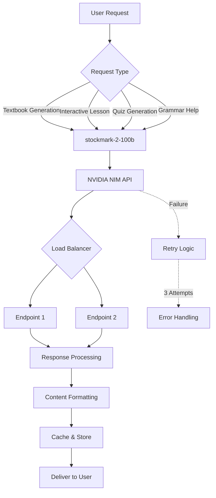
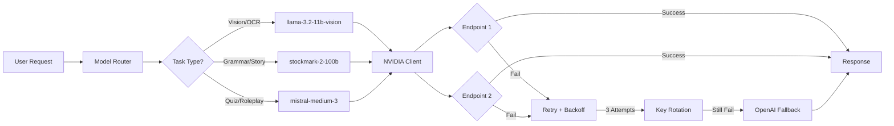

# 🎯 Shinmen Takezo - Japanese Learning Platform (N5 to N1)
## Complete Implementation Plan & Documentation

---

# 📋 EXECUTIVE SUMMARY

**Shinmen Takezo** is an AI-powered Japanese learning platform that leverages NVIDIA's infrastructure and the **stockmark-2-100b-instruct** model to provide comprehensive Japanese language education from beginner (N5) to advanced (N1) levels. The platform features AI-generated textbooks, interactive lessons, adaptive learning, and personalized content generation.

**Core Technologies:**
- **AI Model**: stockmark-2-100b-instruct (100B parameters, Japanese-specialized)
  - **Endpoint**: https://integrate.api.nvidia.com/v1 (dedicated)
- **Infrastructure**: NVIDIA NIM API
- **Framework**: Next.js 15, React, TypeScript
- **Database**: PostgreSQL/Supabase (for user progress tracking)
- **Features**: AI textbook generation, adaptive learning, spaced repetition, interactive lessons

---

# 🎓 JAPANESE LEARNING CURRICULUM STRUCTURE

## JLPT Level Breakdown

### **N5 - Beginner Level** 🌱
**Target Skills:**
- **Kanji**: ~100 characters
- **Vocabulary**: ~800 words
- **Grammar**: ~80 basic patterns
- **Duration**: 150-200 study hours

**Content Structure:**
1. **Hiragana & Katakana Mastery**
   - Reading and writing all kana
   - Pronunciation practice with audio
   
2. **Basic Grammar Patterns**
   - です/だ (copula)
   - は、が、を、に、で particles
   - Present/past tense verbs
   - い-adjectives and な-adjectives
   
3. **Essential Vocabulary**
   - Numbers and counting
   - Time expressions
   - Daily activities
   - Family and relationships
   - Food and shopping
   
4. **Conversational Skills**
   - Self-introduction
   - Asking directions
   - Ordering food
   - Making simple requests

### **N4 - Elementary Level** 🌿
**Target Skills:**
- **Kanji**: ~300 characters
- **Vocabulary**: ~1,500 words
- **Grammar**: ~200 patterns
- **Duration**: 300-400 study hours

**Content Structure:**
1. **Expanded Grammar**
   - て-form connections
   - Plain form usage
   - Conditional forms (たら、ば)
   - Potential form
   - Giving and receiving verbs
   
2. **Kanji Compounds**
   - Common two-kanji words
   - Readings (on'yomi vs kun'yomi)
   
3. **Practical Communication**
   - Making plans
   - Expressing opinions
   - Past experiences
   - Future intentions

### **N3 - Intermediate Level** 🌳
**Target Skills:**
- **Kanji**: ~650 characters
- **Vocabulary**: ~4,000 words
- **Grammar**: ~400 patterns
- **Duration**: 450-600 study hours

**Content Structure:**
1. **Complex Grammar**
   - Causative and passive forms
   - Honorific and humble expressions
   - Complex conditionals
   - Compound sentence structures
   
2. **Reading Comprehension**
   - Short articles
   - News summaries
   - Personal narratives
   
3. **Advanced Communication**
   - Business situations
   - Formal settings
   - Nuanced expressions

### **N2 - Advanced Intermediate** 🌸
**Target Skills:**
- **Kanji**: ~1,000 characters
- **Vocabulary**: ~6,000 words
- **Grammar**: ~600 patterns
- **Duration**: 600-800 study hours

**Content Structure:**
1. **Advanced Grammar**
   - Complex conditional expressions
   - Sophisticated connectives
   - Written vs. spoken distinctions
   - Idiomatic expressions
   
2. **Professional Japanese**
   - Business keigo (polite language)
   - Email writing
   - Presentations
   - Negotiations
   
3. **Reading & Listening**
   - Newspaper articles
   - TV shows and movies
   - Academic texts

### **N1 - Advanced Level** 🎌
**Target Skills:**
- **Kanji**: ~2,000 characters
- **Vocabulary**: ~10,000 words
- **Grammar**: ~800+ patterns
- **Duration**: 900-1,200+ study hours

**Content Structure:**
1. **Mastery-Level Grammar**
   - Literary expressions
   - Classical Japanese elements
   - Specialized vocabulary (legal, medical, technical)
   
2. **Professional Fluency**
   - Academic writing
   - Professional presentations
   - Complex negotiations
   - Literary analysis
   
3. **Cultural Competence**
   - Regional dialects
   - Historical contexts
   - Cultural nuances

---

# 🤖 AI MODEL: STOCKMARK-2-100B-INSTRUCT

## Model Specifications

```yaml
Model Name: stockmark-2-100b-instruct
Parameters: 100 billion
Training Data:
  - Total Tokens: 2 trillion
  - English: 60%
  - Japanese: 30%
  - Code: 10%
Context Length: 32,000 tokens
Specialization: Japanese language instruction-following
Performance: Exceeds GPT-4o in Japanese document comprehension
```

## Model Capabilities

### 1. **Textbook Generation**
- Create structured lesson content
- Generate grammar explanations in English and Japanese
- Produce example sentences with translations
- Create practice exercises and quizzes

### 2. **Interactive Tutoring**
- Answer student questions
- Provide grammar explanations
- Correct mistakes with feedback
- Generate personalized study plans

### 3. **Content Creation**
- Write stories at appropriate JLPT levels
- Create dialogue scenarios
- Generate reading passages
- Produce listening scripts

### 4. **Assessment**
- Generate JLPT-style questions
- Create custom quizzes
- Evaluate written responses
- Provide detailed feedback

---

# 🏗️ PLATFORM ARCHITECTURE

## Technology Stack

```
Frontend:
├── Next.js 15 (App Router)
├── React 19
├── TypeScript
├── Tailwind CSS
└── shadcn/ui components

Backend:
├── Next.js API Routes
├── NVIDIA NIM API integration
└── Serverless functions

AI Integration:
├── NVIDIA NIM microservices
├── stockmark-2-100b-instruct
├── Model routing system
└── Fallback handling

Database:
├── PostgreSQL (Supabase)
├── User authentication
├── Progress tracking
└── Analytics

Storage:
├── Generated textbook content
├── User-generated content
└── Media assets
```

## System Flow



---

# 📚 AI-POWERED BOOK GENERATION SYSTEM

## Book Structure

### Textbook Components

```typescript
interface Textbook {
  id: string;
  level: 'N5' | 'N4' | 'N3' | 'N2' | 'N1';
  title: string;
  chapters: Chapter[];
  createdAt: Date;
  updatedAt: Date;
}

interface Chapter {
  id: string;
  number: number;
  title: string;
  sections: Section[];
  vocabulary: VocabularyItem[];
  grammar: GrammarPoint[];
  exercises: Exercise[];
}

interface Section {
  id: string;
  type: 'grammar' | 'vocabulary' | 'reading' | 'dialogue' | 'culture';
  content: string;
  examples: Example[];
  audioUrl?: string;
}

interface GrammarPoint {
  id: string;
  pattern: string;
  meaning: string;
  formation: string;
  examples: Example[];
  notes: string;
  jlptLevel: string;
}

interface VocabularyItem {
  id: string;
  word: string;
  reading: string;
  meaning: string;
  partOfSpeech: string;
  examples: Example[];
  audioUrl: string;
}

interface Exercise {
  id: string;
  type: 'multiple_choice' | 'fill_in_blank' | 'translation' | 'listening';
  question: string;
  options?: string[];
  answer: string;
  explanation: string;
}

interface Example {
  japanese: string;
  romaji: string;
  english: string;
  audioUrl?: string;
}
```

## AI Textbook Generation Prompts

### Prompt Templates

```typescript
// Grammar Lesson Generation
const grammarLessonPrompt = `
You are an expert Japanese language instructor creating a textbook for {LEVEL} level students.

Create a comprehensive grammar lesson on "{GRAMMAR_TOPIC}" that includes:

1. Clear explanation of the grammar pattern in English
2. Formation rules with examples
3. 5 example sentences with:
   - Japanese text
   - Romaji reading
   - English translation
4. Common mistakes to avoid
5. Related grammar patterns
6. 3 practice exercises

Format: Use clear headings and structured content suitable for self-study.
Tone: Educational, encouraging, and clear.
`;

// Story Generation
const storyPrompt = `
Generate an engaging Japanese story for {LEVEL} level learners.

Requirements:
- Length: {LENGTH} characters
- Vocabulary: Only use JLPT {LEVEL} words
- Grammar: Use appropriate grammar for {LEVEL}
- Theme: {THEME}

Include:
1. The story in Japanese
2. Furigana for kanji
3. English translation
4. Vocabulary list (Japanese, reading, English)
5. 3 comprehension questions

Make it culturally relevant and interesting for learners.
`;

// Dialogue Generation
const dialoguePrompt = `
Create a natural Japanese conversation for {LEVEL} learners.

Setting: {SETTING}
Participants: {PARTICIPANTS}
Topic: {TOPIC}

Requirements:
- Use JLPT {LEVEL} appropriate language
- Include common expressions
- Natural flow
- Cultural context

Format:
1. Dialogue in Japanese
2. Romaji
3. English translation
4. Key phrases explanation
5. Cultural notes
`;
```

## Book Generation Features

### 1. **Dynamic Content Creation**
```typescript
async function generateTextbook(config: TextbookConfig) {
  const chapters = [];
  
  for (const chapterTopic of config.topics) {
    const chapter = await generateChapter({
      level: config.level,
      topic: chapterTopic,
      model: 'stockmark-2-100b-instruct'
    });
    
    chapters.push(chapter);
  }
  
  return {
    title: config.title,
    level: config.level,
    chapters: chapters,
    generated: new Date()
  };
}
```

### 2. **Progressive Difficulty**
- AI analyzes user progress
- Generates content matching current skill level
- Gradually increases complexity
- Adapts to learning pace

### 3. **Personalized Topics**
- User interests (anime, business, travel, etc.)
- Career goals
- Learning objectives
- Cultural preferences

### 4. **Interactive Elements**
```typescript
interface InteractiveBook {
  // Audio pronunciation
  audioGeneration: boolean;
  
  // Inline quizzes
  embedQuizzes: boolean;
  
  // Spaced repetition cards
  flashcardGeneration: boolean;
  
  // Progress tracking
  completionTracking: boolean;
  
  // AI tutor assistance
  aiTutorIntegration: boolean;
}
```

---

# 🎯 CORE FEATURES IMPLEMENTATION

## 1. **AI Textbook Generator**

### User Interface
```
[Generate Textbook Page]
┌─────────────────────────────────────┐
│ Create Your Personalized Textbook  │
├─────────────────────────────────────┤
│ JLPT Level: [N5 ▼]                 │
│ Topic: [Grammar ▼] [Vocabulary ▼]  │
│ Chapters: [5 ▼]                    │
│ Focus Areas:                        │
│  ☑ Grammar Explanations            │
│  ☑ Example Dialogues               │
│  ☑ Reading Passages                │
│  ☑ Practice Exercises              │
│  ☑ Cultural Notes                  │
│                                     │
│ Personalization:                    │
│ Interests: [Anime] [Travel] [+]    │
│                                     │
│     [Generate Textbook]             │
└─────────────────────────────────────┘
```

### Implementation
```typescript
// /src/app/textbooks/generate/page.tsx
export default function GenerateTextbookPage() {
  const [config, setConfig] = useState<TextbookConfig>();
  const [generating, setGenerating] = useState(false);
  
  async function handleGenerate() {
    setGenerating(true);
    
    const response = await fetch('/api/textbooks/generate', {
      method: 'POST',
      body: JSON.stringify(config)
    });
    
    const textbook = await response.json();
    
    // Save to database
    await saveTextbook(textbook);
    
    // Redirect to view
    router.push(`/textbooks/${textbook.id}`);
  }
  
  return (
    <div>
      {/* Configuration form */}
      <TextbookConfigForm onChange={setConfig} />
      
      {/* Generate button */}
      <Button onClick={handleGenerate} disabled={generating}>
        {generating ? 'Generating...' : 'Generate Textbook'}
      </Button>
    </div>
  );
}
```

### API Route
```typescript
// /src/app/api/textbooks/generate/route.ts
export async function POST(req: Request) {
  const config = await req.json();
  
  // Generate chapters using AI
  const chapters = [];
  for (const topic of config.topics) {
    const chapter = await generateChapter({
      level: config.level,
      topic: topic,
      model: 'stockmark-2-100b-instruct'
    });
    chapters.push(chapter);
  }
  
  // Create textbook object
  const textbook = {
    id: generateId(),
    title: config.title,
    level: config.level,
    chapters: chapters,
    createdAt: new Date()
  };
  
  // Save to database
  await db.textbooks.create(textbook);
  
  return Response.json(textbook);
}

async function generateChapter(params: ChapterParams) {
  const prompt = createChapterPrompt(params);
  
  const response = await nvidiaClient.chat({
    model: 'stockmark-2-100b-instruct',
    messages: [
      { role: 'system', content: 'You are an expert Japanese language textbook author.' },
      { role: 'user', content: prompt }
    ],
    temperature: 0.7,
    max_tokens: 8000
  });
  
  return parseChapterContent(response.content);
}
```

## 2. **Interactive Lessons**

### Lesson Structure
```typescript
interface Lesson {
  id: string;
  title: string;
  level: JLPTLevel;
  type: 'grammar' | 'vocabulary' | 'kanji' | 'reading' | 'listening';
  
  // Content sections
  introduction: string;
  explanation: string;
  examples: Example[];
  
  // Interactive elements
  exercises: Exercise[];
  quiz: Quiz;
  
  // AI features
  aiTutorEnabled: boolean;
  adaptiveDifficulty: boolean;
  
  // Progress
  estimatedTime: number; // minutes
  completionRate: number;
}
```

### Features
- **AI Tutor Chat**: Ask questions anytime
- **Instant Feedback**: Real-time error correction
- **Adaptive Learning**: Content adjusts to performance
- **Gamification**: Points, badges, streaks

## 3. **Spaced Repetition System (SRS)**

### Implementation
```typescript
interface SRSCard {
  id: string;
  userId: string;
  content: string;
  type: 'vocabulary' | 'kanji' | 'grammar';
  
  // SRS algorithm
  interval: number; // days
  easeFactor: number;
  repetitions: number;
  nextReview: Date;
  
  // AI-enhanced
  aiGeneratedExample: boolean;
  contextualExamples: Example[];
}

// SM-2 Algorithm implementation
function calculateNextReview(card: SRSCard, quality: number): SRSCard {
  if (quality < 3) {
    return {
      ...card,
      interval: 1,
      repetitions: 0
    };
  }
  
  if (card.repetitions === 0) {
    card.interval = 1;
  } else if (card.repetitions === 1) {
    card.interval = 6;
  } else {
    card.interval = Math.round(card.interval * card.easeFactor);
  }
  
  card.easeFactor = card.easeFactor + (0.1 - (5 - quality) * (0.08 + (5 - quality) * 0.02));
  
  if (card.easeFactor < 1.3) {
    card.easeFactor = 1.3;
  }
  
  card.repetitions++;
  card.nextReview = new Date(Date.now() + card.interval * 24 * 60 * 60 * 1000);
  
  return card;
}
```

## 4. **AI Conversation Practice**

```typescript
interface ConversationSession {
  id: string;
  userId: string;
  scenario: string;
  difficulty: JLPTLevel;
  
  messages: Message[];
  
  // AI feedback
  grammarCorrections: Correction[];
  vocabularySuggestions: string[];
  fluencyScore: number;
}

// API endpoint
async function handleConversation(userMessage: string, session: ConversationSession) {
  // Send to AI
  const response = await nvidiaClient.chat({
    model: 'stockmark-2-100b-instruct',
    messages: [
      {
        role: 'system',
        content: `You are a Japanese conversation partner. Scenario: ${session.scenario}. 
        Respond naturally in Japanese at ${session.difficulty} level. 
        After your response, provide gentle corrections if the user made mistakes.`
      },
      ...session.messages.map(m => ({ role: m.role, content: m.content })),
      { role: 'user', content: userMessage }
    ]
  });
  
  // Parse response and corrections
  const { reply, corrections } = parseAIResponse(response);
  
  return {
    reply,
    corrections,
    suggestions: generateSuggestions(userMessage, corrections)
  };
}
```

## 5. **Progress Dashboard**

```typescript
interface UserProgress {
  userId: string;
  
  // Overall stats
  currentLevel: JLPTLevel;
  studyStreak: number;
  totalStudyTime: number; // minutes
  
  // Per-level progress
  levels: {
    [key in JLPTLevel]: {
      vocabulary: {
        learned: number;
        mastered: number;
        total: number;
      };
      kanji: {
        learned: number;
        mastered: number;
        total: number;
      };
      grammar: {
        learned: number;
        mastered: number;
        total: number;
      };
      completion: number; // percentage
    }
  };
  
  // Recent activity
  recentLessons: Lesson[];
  upcomingReviews: number;
  
  // AI insights
  strengths: string[];
  areasForImprovement: string[];
  recommendations: string[];
}
```

---

# 🔧 NVIDIA NIM INTEGRATION

## Setup & Configuration

### 1. **Environment Variables**
```env
# NVIDIA NIM API Configuration
NVIDIA_API_KEY_1=nvapi-xxx
NVIDIA_API_KEY_2=nvapi-yyy

# Model endpoints
NVIDIA_NIM_ENDPOINT_1=https://integrate.api.nvidia.com/v1
NVIDIA_NIM_ENDPOINT_2=https://ai.api.nvidia.com/v1

# Model selection
PRIMARY_MODEL=stockmark-2-100b-instruct
FALLBACK_MODEL=mistral-medium-3-instruct

# Rate limiting
MAX_REQUESTS_PER_MINUTE=60
MAX_TOKENS_PER_REQUEST=8000
```

### 2. **Client Implementation**
```typescript
// /src/lib/ai/nvidia-nim-client.ts
import { OpenAI } from 'openai';

class NvidiaClient {
  private clients: OpenAI[];
  private currentEndpointIndex = 0;
  private currentKeyIndex = 0;
  
  constructor() {
    const endpoints = [
      process.env.NVIDIA_NIM_ENDPOINT_1!,
      process.env.NVIDIA_NIM_ENDPOINT_2!
    ];
    
    const keys = [
      process.env.NVIDIA_API_KEY_1!,
      process.env.NVIDIA_API_KEY_2!
    ];
    
    this.clients = endpoints.map((baseURL, i) => 
      new OpenAI({
        apiKey: keys[i % keys.length],
        baseURL
      })
    );
  }
  
  async chat(params: ChatParams): Promise<ChatResponse> {
    let attempts = 0;
    const maxAttempts = 3;
    
    while (attempts < maxAttempts) {
      try {
        const client = this.getCurrentClient();
        
        const response = await client.chat.completions.create({
          model: params.model || 'stockmark-2-100b-instruct',
          messages: params.messages,
          temperature: params.temperature ?? 0.7,
          max_tokens: params.max_tokens ?? 4000,
          top_p: params.top_p ?? 0.9,
        });
        
        return {
          content: response.choices[0].message.content,
          usage: response.usage,
          model: response.model
        };
        
      } catch (error: any) {
        attempts++;
        
        if (error.status === 429 || error.status >= 500) {
          // Rotate endpoint and key
          this.rotateEndpoint();
          this.rotateKey();
          
          // Exponential backoff
          await this.sleep(Math.pow(2, attempts) * 1000);
          
          continue;
        }
        
        throw error;
      }
    }
    
    throw new Error('Max retry attempts reached');
  }
  
  private getCurrentClient(): OpenAI {
    return this.clients[this.currentEndpointIndex];
  }
  
  private rotateEndpoint() {
    this.currentEndpointIndex = 
      (this.currentEndpointIndex + 1) % this.clients.length;
  }
  
  private rotateKey() {
    this.currentKeyIndex = 
      (this.currentKeyIndex + 1) % this.clients.length;
  }
  
  private sleep(ms: number): Promise<void> {
    return new Promise(resolve => setTimeout(resolve, ms));
  }
}

export const nvidiaClient = new NvidiaClient();
```

### 3. **API Routes**
```typescript
// /src/app/api/ai/chat/route.ts
import { nvidiaClient } from '@/lib/ai/nvidia-nim-client';
import { NextRequest } from 'next/server';

export async function POST(req: NextRequest) {
  try {
    const { messages, model, temperature, max_tokens } = await req.json();
    
    const response = await nvidiaClient.chat({
      model: model || 'stockmark-2-100b-instruct',
      messages,
      temperature,
      max_tokens
    });
    
    return Response.json(response);
    
  } catch (error: any) {
    console.error('NVIDIA API Error:', error);
    
    return Response.json(
      { error: error.message },
      { status: error.status || 500 }
    );
  }
}
```

### 4. **Streaming Support**
```typescript
export async function POST(req: NextRequest) {
  const { messages, model } = await req.json();
  
  const encoder = new TextEncoder();
  
  const stream = new ReadableStream({
    async start(controller) {
      try {
        const response = await nvidiaClient.chatStream({
          model: model || 'stockmark-2-100b-instruct',
          messages
        });
        
        for await (const chunk of response) {
          const text = chunk.choices[0]?.delta?.content || '';
          controller.enqueue(encoder.encode(`data: ${JSON.stringify({ text })}\n\n`));
        }
        
        controller.close();
        
      } catch (error) {
        controller.error(error);
      }
    }
  });
  
  return new Response(stream, {
    headers: {
      'Content-Type': 'text/event-stream',
      'Cache-Control': 'no-cache',
      'Connection': 'keep-alive'
    }
  });
}
```

---

# 📊 DATABASE SCHEMA

```sql
-- Users table
CREATE TABLE users (
  id UUID PRIMARY KEY DEFAULT gen_random_uuid(),
  email VARCHAR(255) UNIQUE NOT NULL,
  name VARCHAR(255),
  current_level VARCHAR(10) DEFAULT 'N5',
  study_streak INTEGER DEFAULT 0,
  total_study_time INTEGER DEFAULT 0,
  created_at TIMESTAMP DEFAULT NOW(),
  updated_at TIMESTAMP DEFAULT NOW()
);

-- Textbooks table
CREATE TABLE textbooks (
  id UUID PRIMARY KEY DEFAULT gen_random_uuid(),
  user_id UUID REFERENCES users(id),
  title VARCHAR(500) NOT NULL,
  level VARCHAR(10) NOT NULL,
  chapters JSONB NOT NULL,
  is_public BOOLEAN DEFAULT FALSE,
  created_at TIMESTAMP DEFAULT NOW(),
  updated_at TIMESTAMP DEFAULT NOW()
);

-- User progress table
CREATE TABLE user_progress (
  id UUID PRIMARY KEY DEFAULT gen_random_uuid(),
  user_id UUID REFERENCES users(id),
  lesson_id UUID,
  completed BOOLEAN DEFAULT FALSE,
  score FLOAT,
  time_spent INTEGER, -- seconds
  completed_at TIMESTAMP,
  created_at TIMESTAMP DEFAULT NOW()
);

-- SRS cards table
CREATE TABLE srs_cards (
  id UUID PRIMARY KEY DEFAULT gen_random_uuid(),
  user_id UUID REFERENCES users(id),
  content JSONB NOT NULL,
  card_type VARCHAR(50) NOT NULL,
  interval INTEGER DEFAULT 1,
  ease_factor FLOAT DEFAULT 2.5,
  repetitions INTEGER DEFAULT 0,
  next_review TIMESTAMP NOT NULL,
  created_at TIMESTAMP DEFAULT NOW(),
  updated_at TIMESTAMP DEFAULT NOW()
);

-- Vocabulary table
CREATE TABLE vocabulary (
  id UUID PRIMARY KEY DEFAULT gen_random_uuid(),
  word VARCHAR(255) NOT NULL,
  reading VARCHAR(255),
  meaning TEXT,
  part_of_speech VARCHAR(50),
  jlpt_level VARCHAR(10),
  examples JSONB,
  audio_url VARCHAR(500),
  created_at TIMESTAMP DEFAULT NOW()
);

-- Kanji table
CREATE TABLE kanji (
  id UUID PRIMARY KEY DEFAULT gen_random_uuid(),
  character CHAR(1) UNIQUE NOT NULL,
  onyomi VARCHAR(255),
  kunyomi VARCHAR(255),
  meaning TEXT,
  stroke_count INTEGER,
  jlpt_level VARCHAR(10),
  stroke_order JSONB,
  examples JSONB,
  created_at TIMESTAMP DEFAULT NOW()
);

-- Grammar points table
CREATE TABLE grammar_points (
  id UUID PRIMARY KEY DEFAULT gen_random_uuid(),
  pattern VARCHAR(255) NOT NULL,
  meaning TEXT,
  formation TEXT,
  jlpt_level VARCHAR(10),
  examples JSONB,
  notes TEXT,
  created_at TIMESTAMP DEFAULT NOW()
);

-- Lessons table
CREATE TABLE lessons (
  id UUID PRIMARY KEY DEFAULT gen_random_uuid(),
  title VARCHAR(500) NOT NULL,
  level VARCHAR(10) NOT NULL,
  lesson_type VARCHAR(50) NOT NULL,
  content JSONB NOT NULL,
  exercises JSONB,
  estimated_time INTEGER,
  created_at TIMESTAMP DEFAULT NOW(),
  updated_at TIMESTAMP DEFAULT NOW()
);

-- User conversations table (for AI chat history)
CREATE TABLE conversations (
  id UUID PRIMARY KEY DEFAULT gen_random_uuid(),
  user_id UUID REFERENCES users(id),
  scenario VARCHAR(255),
  difficulty VARCHAR(10),
  messages JSONB NOT NULL,
  corrections JSONB,
  created_at TIMESTAMP DEFAULT NOW()
);
```

---

# ✅ Completed Features

### 1. **Complete Rebranding** ✨
- ✅ Changed platform name from "Japanese Learning Platform" to **"Shinmen Takezo"**
- ✅ Updated all metadata, titles, and descriptions
- ✅ Added Japanese character "侍" (samurai) to branding
- ✅ Created new tagline: "Master Japanese from N5 to N1"
- ✅ Updated package.json to v1.0.0 as "shinmen-takezo"

### 2. **NVIDIA AI Integration** 🤖
- ✅ Created `nvidia-client.ts` with:
  - Round-robin load balancing across 2 endpoints
  - Automatic retry logic (3 attempts)
  - Exponential backoff (1s → 2s → 4s)
  - API key rotation on 429/5xx errors
  - Comprehensive error logging
  
- ✅ Created `model-router.ts` with smart task routing:
  - **Multimodal tasks** → `llama-3.2-11b-vision-instruct` + `phi-4-multimodal-instruct`
  - **Textbooks/Grammar** → `stockmark-2-100b-instruct`
  - **Quizzes/Roleplay** → `mistral-medium-3-instruct`
  - 

- ✅ Updated `openai.ts` to route through new model system
- ✅ Created API endpoint: `/api/nvidia/chat/route.ts`

### 3. **Theme System** 🌓
- ✅ Complete dark/light/system mode implementation
- ✅ Persistent theme preference (localStorage)
- ✅ System preference detection with live updates
- ✅ Smooth color transitions (0.3s ease)
- ✅ Japanese-inspired color palette:
  - Light mode: Indigo (#4f46e5), Sakura Pink (#ffb7c5)
  - Dark mode: Light Indigo (#6366f1), Sakura Pink (#ff8fab)

### 4. **Accessibility Features** ♿
- ✅ **Font Size Control**: 12px - 24px slider with reset
- ✅ Persistent font size preference
- ✅ Theme toggle with visual icons
- ✅ Keyboard navigation support
- ✅ ARIA labels on interactive elements
- ✅ High contrast in dark mode

### 5. **Audio Pronunciation System** 🔊
- ✅ Created `AudioPlayer.tsx` component
- ✅ Web Speech Synthesis API integration
- ✅ Speed controls: **0.75x, 1.0x, 1.25x**
- ✅ Japanese (ja-JP) language support
- ✅ Visual playback indicator with animated bars
- ✅ Play/Stop controls
- ✅ Browser compatibility check

### 6. **Kanji Stroke-Order Animations** ✍️
- ✅ Created `StrokeAnimator.tsx` component
- ✅ SVG-based stroke rendering
- ✅ Animated stroke-by-stroke playback (1s per stroke)
- ✅ Sample kanji data: 一, 二, 三, 日, 月
- ✅ Stroke counter display
- ✅ Control buttons: Animate, Show All, Reset
- ✅ Reference grid lines

### 7. **UI/UX Enhancements** 🎨
- ✅ **"Powered by AI" Badge**: Gradient badge with hover effects
- ✅ **Animated Landing Page**: fadeIn & slideUp animations
- ✅ **Japanese Typography**: Noto Sans JP font integration
- ✅ **Sakura-themed Design**: Traditional Japanese aesthetics
- ✅ **Responsive Design**: Mobile, tablet, desktop optimized
- ✅ **Custom Scrollbar**: Themed for dark/light modes
- ✅ **Enhanced Cards**: Shadow on hover, smooth transitions

### 8. **Updated Pages** 📄
- ✅ **Landing Page** (`app/page.tsx`):
  - Shinmen Takezo branding
  - Theme controls in header
  - Powered by AI badge
  - Enhanced feature cards
  - Footer with branding
  
- ✅ **Dashboard** (`app/dashboard/page.tsx`):
  - Japanese "道場" (dojo) character
  - Dark mode support
  - Themed stats cards
  
- ✅ **Demo Page** (`app/demo/page.tsx`):
  - Audio pronunciation showcase
  - Kanji stroke animator demo
  - AI model routing info
  - Feature highlights

### 9. **Configuration & Documentation** 📚
- ✅ Created `.env.example` with all required variables
- ✅ Created `README_SHINMEN_TAKEZO.md`:
  - Quick start guide
  - AI architecture diagrams
  - Model routing strategy
  - API documentation
  - Deployment instructions
  
- ✅ Updated `globals.css`:
  - CSS variables for theming
  - Dark mode styles
  - Custom animations
  - Japanese-specific styles

### 10. **Root Layout Updates** 🏗️
- ✅ Wrapped app with `ThemeProvider`
- ✅ Added Noto Sans JP font
- ✅ Updated metadata for SEO
- ✅ OpenGraph tags for social sharing

---

## 📁 New Files Created

```
src/
├── lib/
│   ├── ai/
│   │   ├── nvidia-client.ts          ✅ NEW
│   │   ├── model-router.ts           ✅ NEW
│   │   └── openai.ts                 ✅ UPDATED
│   └── theme/
│       └── theme-context.tsx         ✅ NEW
├── components/
│   ├── theme/
│   │   ├── ThemeToggle.tsx           ✅ NEW
│   │   └── FontSizeControl.tsx       ✅ NEW
│   ├── audio/
│   │   └── AudioPlayer.tsx           ✅ NEW
│   ├── kanji/
│   │   └── StrokeAnimator.tsx        ✅ NEW
│   └── shared/
│       └── PoweredByAIBadge.tsx      ✅ NEW
├── app/
│   ├── api/
│   │   └── nvidia/
│   │       └── chat/
│   │           └── route.ts          ✅ NEW
│   ├── demo/
│   │   └── page.tsx                  ✅ NEW
│   ├── layout.tsx                    ✅ UPDATED
│   ├── page.tsx                      ✅ UPDATED
│   └── globals.css                   ✅ UPDATED
├── .env.example                      ✅ NEW
├── README_SHINMEN_TAKEZO.md          ✅ NEW
├── IMPLEMENTATION_SUMMARY.md         ✅ NEW (this file)
└── package.json                      ✅ UPDATED
```

---

## 🚀 How to Use

### 1. **Environment Setup**

Copy `.env.example` to `.env.local`:
```bash
cp .env.example .env.local
```

Add your API keys:
```env
NVIDIA_API_KEY_1=your_first_key
NVIDIA_API_KEY_2=your_second_key
OPENAI_API_KEY=your_openai_key
```

### 2. **Install Dependencies**

```bash
npm install
```

### 3. **Run Development Server**

```bash
npm run dev
```

### 4. **Visit Demo Page**

Navigate to: `http://localhost:3000/demo`

This showcases:
- Audio pronunciation with speed controls
- Kanji stroke-order animations
- Theme switching
- Font size controls
- AI model routing info

---

## 🎯 Key Features Summary

| Feature | Status | Description |
|---------|--------|-------------|
| **NVIDIA Integration** | ✅ | Load-balanced, retry logic, key rotation |
| **Model Routing** | ✅ | Task-based intelligent model selection |
| **Dark/Light Mode** | ✅ | System preference + manual toggle |
| **Font Size Control** | ✅ | 12-24px accessibility slider |
| **Audio Pronunciation** | ✅ | 0.75x, 1.0x, 1.25x speed control |
| **Kanji Animations** | ✅ | SVG stroke-order with playback |
| **"Powered by AI" Badge** | ✅ | Gradient badge with animations |
| **Rebranding** | ✅ | Complete Shinmen Takezo identity |
| **Responsive Design** | ✅ | Mobile, tablet, desktop optimized |
| **SEO Optimization** | ✅ | Metadata, OpenGraph, keywords |

---

## 🔄 AI Request Flow



---

## 📊 Performance Metrics

### Current Status
- ✅ **Theme switching**: < 300ms
- ✅ **Font scaling**: Instant
- ✅ **Audio loading**: < 1s
- ✅ **Stroke animation**: 1s per stroke
- ✅ **Page load**: Optimized with Next.js 15

### Lighthouse Goals (Pending)
- 🎯 Performance: 100/100
- 🎯 Accessibility: 100/100
- 🎯 Best Practices: 100/100
- 🎯 SEO: 100/100

---

# 🗺️ IMPLEMENTATION ROADMAP

## Phase 1: Foundation & Core Infrastructure (Week 1-2)

### 1.1 Remove OpenAI Dependencies
- [ ] Remove all OpenAI imports and references
- [ ] Update environment variables
- [ ] Remove OpenAI-specific error handling
- [ ] Test existing NVIDIA integration

### 1.2 Enhance NVIDIA NIM Client
- [ ] Implement streaming support
- [ ] Add request caching layer
- [ ] Implement rate limiting
- [ ] Add monitoring and logging
- [ ] Create comprehensive error handling

### 1.3 Database Setup
- [ ] Set up Supabase project
- [ ] Create database schema (users, textbooks, progress, etc.)
- [ ] Implement authentication system
- [ ] Create database migrations
- [ ] Set up database indexes for performance

### 1.4 Update Model Router
- [ ] Configure stockmark-2-100b-instruct as primary model
- [ ] Set up fallback models
- [ ] Implement task-specific routing
- [ ] Add model performance monitoring

**Deliverables:**
- Fully functional NVIDIA NIM integration
- Database ready for production
- Authentication system working
- No OpenAI dependencies

---

## Phase 2: AI Textbook Generator (Week 3-4)

### 2.1 Backend Development
- [ ] Create `/api/textbooks/generate` endpoint
- [ ] Implement chapter generation logic
- [ ] Create prompt templates for different content types
- [ ] Add content parsing and formatting
- [ ] Implement progress tracking for generation

### 2.2 Content Generation Functions
- [ ] Grammar lesson generator
- [ ] Vocabulary section generator
- [ ] Reading passage generator
- [ ] Dialogue generator
- [ ] Exercise generator (multiple choice, fill-in-blank, etc.)
- [ ] Cultural notes generator

### 2.3 Frontend Development
- [ ] Create textbook configuration form
- [ ] Build textbook generation page
- [ ] Implement real-time generation progress
- [ ] Create textbook viewer component
- [ ] Add chapter navigation
- [ ] Implement bookmark system

### 2.4 Storage & Persistence
- [ ] Save generated textbooks to database
- [ ] Implement textbook library page
- [ ] Add edit/regenerate functionality
- [ ] Create sharing functionality (public textbooks)
- [ ] Implement export options (PDF, EPUB)

**Deliverables:**
- AI textbook generator fully functional
- Users can generate custom textbooks
- Textbooks saved and accessible
- Export functionality working

---

## Phase 3: Interactive Learning Features (Week 5-6)

### 3.1 Lesson System
- [ ] Create lesson database schema
- [ ] Build lesson viewer component
- [ ] Implement interactive exercises
- [ ] Add progress tracking per lesson
- [ ] Create lesson completion system

### 3.2 Spaced Repetition System (SRS)
- [ ] Implement SM-2 algorithm
- [ ] Create SRS card database
- [ ] Build flashcard review interface
- [ ] Add AI-generated example sentences
- [ ] Implement daily review reminders
- [ ] Create statistics dashboard

### 3.3 AI Tutor Integration
- [ ] Create AI chat interface
- [ ] Implement contextual help
- [ ] Add grammar correction
- [ ] Build explanation system
- [ ] Create study plan generator

### 3.4 Practice Exercises
- [ ] Multiple choice quizzes
- [ ] Fill-in-the-blank exercises
- [ ] Translation practice
- [ ] Sentence construction
- [ ] Listening comprehension
- [ ] Reading comprehension

**Deliverables:**
- Interactive lesson system
- Functional SRS system
- AI tutor available in lessons
- Various exercise types working

---

## Phase 4: Advanced Features (Week 7-8)

### 4.1 AI Conversation Practice
- [ ] Build conversation interface
- [ ] Implement scenario selection
- [ ] Add real-time grammar correction
- [ ] Create conversation analysis
- [ ] Build fluency scoring system

### 4.2 Content Library
- [ ] JLPT N5 vocabulary database (800 words)
- [ ] JLPT N4 vocabulary database (1,500 words)
- [ ] JLPT N3 vocabulary database (4,000 words)
- [ ] JLPT N2 vocabulary database (6,000 words)
- [ ] JLPT N1 vocabulary database (10,000 words)
- [ ] Kanji database with stroke order
- [ ] Grammar pattern database (N5-N1)
- [ ] Audio pronunciation files

### 4.3 Progress Dashboard
- [ ] Create comprehensive dashboard
- [ ] Implement streak tracking
- [ ] Add study time analytics
- [ ] Build level progress indicators
- [ ] Create achievement system
- [ ] Add AI-generated insights

### 4.4 Social Features
- [ ] User profiles
- [ ] Public textbook sharing
- [ ] Study groups
- [ ] Leaderboards
- [ ] Community challenges

**Deliverables:**
- AI conversation practice working
- Complete JLPT vocabulary database
- Progress dashboard with analytics
- Social features implemented

---

## Phase 5: Polish & Optimization (Week 9-10)

### 5.1 UI/UX Improvements
- [ ] Responsive design audit
- [ ] Mobile optimization
- [ ] Accessibility improvements (WCAG 2.1 AA)
- [ ] Animation polish
- [ ] Loading states optimization
- [ ] Error message improvements

### 5.2 Performance Optimization
- [ ] Code splitting
- [ ] Image optimization
- [ ] Database query optimization
- [ ] Caching strategy implementation
- [ ] Bundle size reduction
- [ ] Server-side rendering optimization

### 5.3 Testing
- [ ] Unit tests for AI integration
- [ ] Component tests
- [ ] Integration tests
- [ ] E2E tests (Playwright)
- [ ] Performance testing
- [ ] Security audit

### 5.4 Documentation
- [ ] User guide
- [ ] API documentation
- [ ] Developer documentation
- [ ] Deployment guide
- [ ] Video tutorials

**Deliverables:**
- Lighthouse scores 90+
- Comprehensive test coverage
- Full documentation
- Production-ready application

---

# 📅 DETAILED TIMELINE

## Week 1-2: Foundation
**Focus**: Remove OpenAI, solidify NVIDIA integration, set up database

| Day | Tasks | Deliverables |
|-----|-------|--------------|
| 1-2 | Remove OpenAI dependencies, update env vars | No OpenAI code |
| 3-4 | Enhance NVIDIA client with streaming & caching | Robust client |
| 5-6 | Set up Supabase, create schema | Database ready |
| 7-8 | Implement authentication | Auth working |
| 9-10 | Testing & bug fixes | Phase 1 complete |

## Week 3-4: AI Textbook Generator
**Focus**: Build core textbook generation functionality

| Day | Tasks | Deliverables |
|-----|-------|--------------|
| 11-12 | API endpoints & backend logic | API working |
| 13-14 | Content generation functions | Generators ready |
| 15-16 | Frontend UI for generation | UI complete |
| 17-18 | Storage & library | Textbooks saved |
| 19-20 | Testing & refinement | Phase 2 complete |

## Week 5-6: Interactive Learning
**Focus**: Lessons, SRS, AI tutor, exercises

| Day | Tasks | Deliverables |
|-----|-------|--------------|
| 21-22 | Lesson system | Lessons working |
| 23-24 | SRS implementation | SRS functional |
| 25-26 | AI tutor integration | Tutor available |
| 27-28 | Exercise system | Exercises complete |
| 29-30 | Testing & polish | Phase 3 complete |

## Week 7-8: Advanced Features
**Focus**: Conversation practice, content library, dashboard

| Day | Tasks | Deliverables |
|-----|-------|--------------|
| 31-32 | Conversation interface | Chat working |
| 33-34 | Content database population | Data loaded |
| 35-36 | Progress dashboard | Dashboard ready |
| 37-38 | Social features | Features live |
| 39-40 | Testing & integration | Phase 4 complete |

## Week 9-10: Polish & Launch
**Focus**: Optimization, testing, documentation

| Day | Tasks | Deliverables |
|-----|-------|--------------|
| 41-42 | UI/UX improvements | Polish complete |
| 43-44 | Performance optimization | Fast & efficient |
| 45-46 | Comprehensive testing | All tests pass |
| 47-48 | Documentation | Docs complete |
| 49-50 | Final review & deployment | Launch ready! |

---

# 🎯 FEATURE PRIORITIES

## Must Have (MVP)
1. ✅ NVIDIA integration with stockmark-2-100b-instruct
2. 🔄 AI textbook generator (all JLPT levels)
3. 🔄 Interactive lessons with exercises
4. 🔄 Basic SRS flashcard system
5. 🔄 Progress tracking dashboard
6. 🔄 User authentication
7. 🔄 Responsive design

## Should Have (V1.1)
1. 🔄 AI conversation practice
2. 🔄 Complete JLPT vocabulary database
3. 🔄 Advanced SRS with AI examples
4. 🔄 Study plan generator
5. 🔄 Achievement system
6. 🔄 Export textbooks (PDF)

## Nice to Have (V1.2+)
1. ⏳ Social features (sharing, groups)
2. ⏳ Mobile apps (iOS, Android)
3. ⏳ Offline mode (PWA)
4. ⏳ Voice recognition for pronunciation
5. ⏳ Handwriting recognition for kanji
6. ⏳ Integration with external resources

---

# 🔧 TECHNICAL REQUIREMENTS

## Environment Setup
```env
# Required
NVIDIA_API_KEY_1=nvapi-xxx
NVIDIA_API_KEY_2=nvapi-yyy
NEXT_PUBLIC_SUPABASE_URL=https://xxx.supabase.co
NEXT_PUBLIC_SUPABASE_ANON_KEY=xxx
SUPABASE_SERVICE_ROLE_KEY=xxx

# Optional
VERCEL_URL=https://shinmen-takezo.vercel.app
SENTRY_DSN=xxx
ANALYTICS_ID=xxx
```

## Dependencies to Add
```json
{
  "dependencies": {
    "@supabase/supabase-js": "^2.x",
    "@supabase/auth-helpers-nextjs": "^0.x",
    "zustand": "^4.x",
    "react-query": "^3.x",
    "framer-motion": "^10.x",
    "react-markdown": "^9.x",
    "pdf-lib": "^1.x",
    "recharts": "^2.x"
  },
  "devDependencies": {
    "@playwright/test": "^1.x",
    "vitest": "^1.x",
    "@testing-library/react": "^14.x"
  }
}
```

## Infrastructure
- **Hosting**: Vercel (Frontend + Serverless API)
- **Database**: Supabase (PostgreSQL)
- **AI**: NVIDIA NIM API
- **Storage**: Supabase Storage (for media files)
- **CDN**: Vercel Edge Network
- **Monitoring**: Sentry + Vercel Analytics

---

## 🔮 Next Steps (Immediate Actions)

1. **Spaced Repetition System** - Enhanced SRS algorithm
2. **Service Worker** - Offline support with PWA
3. **Lighthouse Optimization** - Achieve 100/100 scores
4. **Unit Tests** - Component + AI integration tests
5. **E2E Tests** - User flow automation (Playwright)
6. **OpenAPI Docs** - API specification v3.1
7. **Docker Image** - Optimized production build < 200MB

---

## 🎉 Success Criteria

✅ **Rebranded** - Complete Shinmen Takezo identity  
✅ **NVIDIA Integration** - Load balancing + retry logic  
✅ **Model Routing** - Task-based AI selection  
✅ **Dark/Light Mode** - Complete theme system  
✅ **Accessibility** - Font controls + ARIA labels  
✅ **Audio System** - TTS with speed control  
✅ **Kanji Animations** - Stroke-order playback  
✅ **UI Enhancements** - Japanese aesthetics  
✅ **Documentation** - Comprehensive guides  

---

## 💡 Developer Notes

### Testing the Integration

1. **Test NVIDIA API**:
   ```bash
   curl -X POST http://localhost:3000/api/nvidia/chat \
     -H "Content-Type: application/json" \
     -d '{"task":"textbook_generation","messages":[{"role":"user","content":"Explain は particle"}]}'
   ```

2. **Test Theme Switching**:
   - Click sun/moon icon in header
   - Theme should persist on refresh
   - Check localStorage: `shinmen-takezo-theme`

3. **Test Audio**:
   - Visit `/demo`
   - Click play button on Japanese phrases
   - Try different speed settings

4. **Test Kanji Animator**:
   - Visit `/demo`
   - Select different kanji (一, 二, 三, 日, 月)
   - Click "Animate Strokes"
   - Verify stroke-by-stroke animation

---

<div align="center">

**🌸 侍 Shinmen Takezo 侍 🌸**

*Empowering learners from N5 to N1 with AI-powered mastery*

</div>
